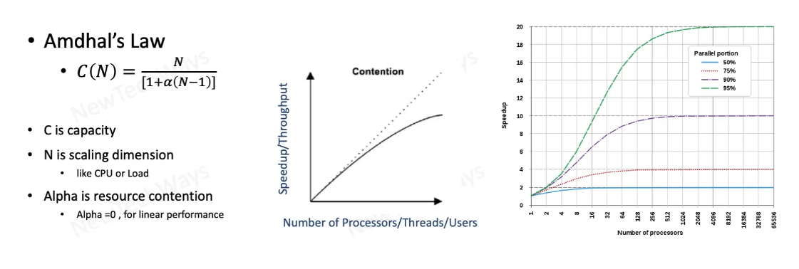
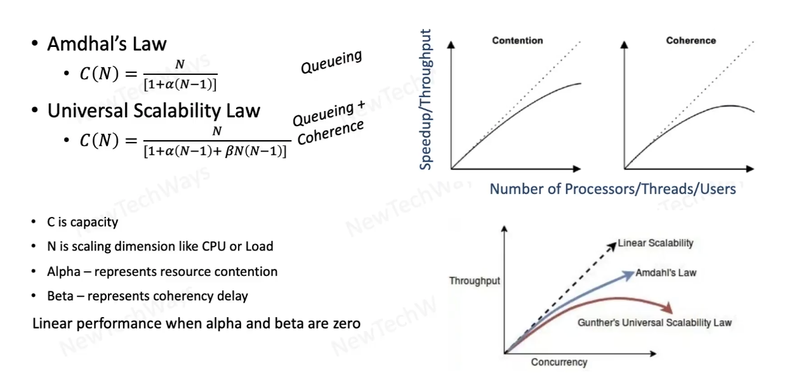

# Section 2: Performance

- [Introduction](#introduction)

- [System Performance](#system-performance)

- Serial Request Latency
  - [Network Transfer Latency](#network-transfer-latency)
  - [Memory Access Latency](#memory-access-latency)
  - [Disk Latency](#disk-latency)
  - [CPU Latency](#cpu-latency)
  - [Common latency costs](#common-latency-costs)
- Paraller Request Latency
  - [Amdahl's law for concurrent tasks](#amdahls-law-for-concurrent-tasks)
  - [Gunther's Universal Scalability](#gunthers-universal-scalability)

## Introduction

### Scope 

- Understanding Performance
  - Problems
  - Measurement
  - Principles
- Latency
  - CPU
  - Network
  - Disk
- Concurrency
  - Locking
    - Pessimistic
    - Optimistic
  - Coherence
- Caching
  - Static Data
  - Dynamic Data

**Sample System**

---

### What is Performance

- Measure of how fast or responsive a system is under
    - A given workload
        - Backend data
        - Request volume
    - A given hardware
        - Kind
        - Capacity

**Goals** 

1. As we increase the workload, performance should stay stable, it should not severely degrate
2. If we increase the hardware capacity, system performance shoould improve

---

### Performance Problems

How to spot a Performance Problem? How does it look like?

> Every performance problem is the result of some queue building somewhere

> Network socket queue, DB IO queue, OS run queue etc

<b>Reasons for queue build-up</b>
- Inefficient slow processing
- Serial resource access
- Limited resource capacity

Goal: To identify where this build up is happening

---

## System Performance 

### Performance Principles

- Efficiency
  - Efficient Resource Utilization
      - IO - Memory, Network, Disk
      - CPU
  - Efficient Logic
      - Algorithms
      - DB Queries
  - Efficient Data Storage
      - Data Structures
      - DB Schema
  - Caching
- Concurrency
  - Hardware
  - Software
    - Queuing
    - Coherence
- Capacity

---

### System Performance Objectives

- Minimize Request-Response Latency
  - Latency is Measured in Time Units
  - Depends on
    - Wait/Idle Time
    - Processing Time
- Maximize Throughput
  - Throughput is Measured as Rate of Request
  - Depends on
    - Latency
    - Capacity

---

### Performance Measurement Metrics

- Latency
  - Affects: User Experience
  - Desired: As low as possible
- Throughput
  - Affects: Number os users that can be supported
  - Desired: Greater than the request rate
- Errors
  - Affects: Functional Correctness
  - Desired: None
- Resource Saturation
  - Affects: Hardware capacity required
  - Desired: Efficient utilization of all system resources

Also

- Tail latency is an indication of queueing of requests
  - Gets worse with higher workloads
- Average latency hides the effects of tail latency
  - Also measure 99 (or 99.9) percentile latency

---

## Network Transfer Latency

part of the **Serial Request Latency**

- Data Transfer (Global / Regional / Local Network)
  - Data Transfer Latency (wires) in Intranet communication is more reliable and fast compared to Internet
  - Browser -> (Multiple hops in between / Lot of networks, latency) -> Web application (Internet) 
- TCP Connection
  - Latency due to creating of TCP connections, e.g. HTTP is over TCP
  - Overhead: TCP SYN, TP SYN ACK (50ms + 50ms RTT, 1 round trip)
- SSL/TLS Connection
  - SSL is over TCP, overhead much more
    - TCP SYN, TCP SYN ACK,
    - SSL Client Hello, SSL Server Hello
    - SSL Key Exchange, SSL Change Cipher
  - Total 3 round trips
 
---

### Minimizing Network transfer

**Connection Pool**: reusing connections that are already created to avoid connection creation latency

**Web server ➡️ App server (Intranet RESTful application)**
- Use of **Connection Pool**
- **Data Format & Compression**
 - instead of RESTful HTTP that will use ascii characters, can use some RPC based protocol which uses binary
   - gRPC, but not RESTful protocol anymore
   - downside: reduces interoperability between applications

**App Server ➡️ Database (Intranet)**
- **Session/Data Caching**
- **Connection Pool**

**Browser ➡️ Web server**
- **Static Data Caching**
- **Compression** with e.g. zip format
  - overhead of compressing the data e.g. ascii to binary and uncompressing, CPU cycles but not that costly
- **SSL Session Caching**
  - when creating repeatedly SSL connections between client and server
  - can reduces the round trips required to create SSL
- RESTful applications require interoperability that's why HTTP protocol is popular in the Internet
- Persistent Connections used by default in HTTP 1.1 and later

---

## Memory Access Latency

**Web Server ➡️ App Server**

- Finite Heap Memory
  - any process that will exceed that amount of memory will crash
  - Garbare collector will run very aggressively just before memory runs out, results to very bad performance
- Large Heap Memory
  - a process occupying more memory than what is available on that machine
  - OS will have to use hard disk, swapping data between physical memory and hard disk
  - that will severly bring down the performance of the process
- GC Algorithm
  - Apply the proper Garbage Collection Algorithm for runtimes that use GC 

**App Server ➡️ Database**

- Finite Buffer memory
  - A write operation happens in DB, DB reads that record from hard disk to memory
  - Space utilization of DB buffer memory is critical because that governs how many operations per second you can actually do
  - If buffer memory is in shortage, either due to poor memory allocation or of inefficient schema, it will severly affect the performance of the entire system

---

### Minimizing memory access latency

**Web Server ➡️ App Server**

- Avoid Memory Bloat
  - Processes should occupy as little memory as possible
  - Codebase is also loaded im memory
    - if number of instructions are lesser, the back and forth between RAM and processor will be lesser
    - small codebase is a good thing
  - Heap space that we are using should be as small as possible, that will create lesser job for Garbage Collector, also lesser changes of going out of memory
- Weak / Soft References
  - useful when we are allocating large objects
- Multiple Smaller Processes
  - Split a batch process among multiple nodes
- Garbage Collection Algorithm
  - Batch process GC
    - goal not the liveness but the efficiency
  - Live application GC

**Database**

already mentioned: should have adequate amount of buffer memory

- Normalization
  - leads to good utilization of buffer memory
  - avoid duplicate data
    - amount of storage becomes lesser, more DB performance
  - sometimes denormalization happens for faster read times
- Compute Over Storage
  - tradeoff: it will add processing cost
  - but will free database space
  - not a problem in the hard disk, but when brought to RAM it will occupy unnecessary memory

Database performance will consequenlty improve the overall system performance as well

---

## Disk Latency

Disk IO is one of the slowest IO we can do
- Logging

Where disk access related **penalties are extremely high**, they are in
- Web applications
  - JS Files, CSS, images from hard disk
- Databases
  - Read / Written ultimately comes / written to hard disc

---

### Minimizing Disk Access Latency

**Browser ➡️ Web Server**
- Web Content Caching
  - static data stored as files on disk, large files fetched very frequently
  - keep that data in memory: caching
  - utilize reverse proxy, has high memory
    - separate the responsibility of hosting dynamic data and static data
    - another machine in between for static content
    - all dynamic request will be directed to web application
- Page Cache, Zero Copy
  - Page Cache, whatever files already read remain in RAM
  - Zero Copy, copying files between disk and network we can do in kernel mode (faster)
  - Those operations are available in reverse proxy
    - Cache: Varnish
    - Reverse proxy: nginx

**Web Server ➡️ App Server**
- Asynchronous Logging
  - main thread remains free, transfers data to another thread
  - slight disadvantage: if application crashes there is no guarantee the last statements will be logged
- Sequential & Batch IO
  - Batch logging will help reducing context switching related cost
  - computation -> logging -> computation -> logging
    - context switching many times, very inefficient
  - combine 4 loggings in one logging statemenent would be more efficient

**App Server**
- Logging sequential write operation
  - sequentially IO is much faster than random IO
- Query Optimization
  - Should be written in a way to fetch minimum data
  - Goes hand in hand with Schema Optimization
- Data Caching
  - Cache DB read only data in memory instead of reading from DB

**DB Disk Access**
- Schema Optimization
  - Denormalization vs Normalization
    - Generally keep data normalized
    - Denormalize data spread over multiple tables, to fetch them from one table
      - fetching from multiple tables require disk rotation, separate IOs, more time than single IO
      - when Disk IO is specifically a problem (and load test shows it), otherwise normalization will save memory
  - Indexes
    - Avoid lot of data that do not need to go through when we have to fetch data
    - Full table scan to find a row without indexes
    - Can use index for filter criteria to know the exact location of the record on the disk
    - There can be inefficiencies because of incorrect indexing
- Higher IOPS, RAID, SSD Disk
  - SSD much faster than regular, higher cost
  - Choose disks with hiher IOPS
  - RAID: replication in multiple disks and partitioning / mirroring
    - parallel reading data, makes IO faster

---

## CPU Latency

**Web Server ➡️ App Server**

- Inefficient Algorithms
- Context Switching

**Context Switching**

Often affects environments where we are running multiple processes or threads. It affects all components.

e.g. Matchine with one Thread

- Process 1 / Thread 1
  - may do some IO, access the disk, network call
- Process 2 / Thread 2
  - gives oportunity to process 2 to occupy CPU, **after some delay**
 

**Why there is a delay between end of process 1 and beginning of process 2?**

OS has to evict process 1
 - take process from CPU and save process to memory (Save state to PCB1)
   - Process control block
  - restore the process 2 and put it on CPU for execution
    - Restore state from PCB2
  - process 2 starts the execution

This wasted time can be avoid by removing the context switch

If we do IO between process execution, then each process will evict CPU for some time
- significant time processes end up wasting
- this hurts performance
- e.g. instead of 100ms can be +100ms

---

### Minimizing CPU processing latency

**Web Server ➡️ App Server**

**Minimize Context Switching**

- Batch / Async IO
  - e.g. multiple calls to DB, not only network overhead but also for CPU
  - should batch multiple calls to one call
  - applies also to read / writes in a file
    - every log is an IO context switching
    - avoid that with async IO in a separate thread, the main thread keeps running
- Single Threaded Model
  - JavaScript engine in Chrome, node.js, VaultDB, nginx
  - each process will execute on the main thread and on the async threads for IO jobs
  - ideal for large flow of requests, with a lot of IO
  - effective way of minimizing CPU latency
- Thread Pool Size
  - should have the right number of threads within a thread pool
  - otherwise it results to a lot of context switching and CPU latency
  - e.g. 2 CPU machine 10 / 20 threads
- Multi-Process in Virtual Env
  - when we run multiple processes on a single machine, we should run them in their own virtual environment
  - e.g. running 4 processes, they will try to contend for the CPU
    - if a process hog CPU, then the other processes they will not get enought CPU time
  - create virtual environments with their dedicated quota of CPU and memory
    - they will not interfere with each other

Single process or virtual environements for each process in large size machines

**App Server**
- Efficient Algorithms
- Efficient Queries

---

## Common latency costs

| Latency Comparison Numbers (~2012) | Time | Comments |
|------------------------------------|------|----------|
| L1 cache reference | 0.5 ns | |
| Branch mispredict  | 5 ns | |
| L2 cache reference  | 7ns | 14x L1 cache |
| Mutex lock/unlock   | 25 ns  | |
| Main memory reference | 100ns | 20x L2 cache, 200x L1 cache |
| Compress 1K bytes with Zippy | 3000ns / 3**us** | |
| Send 1K bytes over 1Gps network | 10us | |
| Read 4K randomly from SSD | 150 us | ~ 1GB/sec SSD |
| Read 1 MB sequentially from memory | 250 us | |
| Round trip within same datacenter | 500us | |
| Read 1 MB sequentially from SSD | 1000us / 1ms | ~ 1GB / sec SSD, 4x memory |
| Disk seek | 10 **ms** | 20x datacenter roundtrip |
| Read 1 MB sequentially from disk | 20ms | 80x memory, 20x SSD |
| Send packet CA->Netherlands->CA | 150ms |

- Calculations
  - Should stay in L1 / L2
- Context Switching
  - When happens the memory latency is introduced 
- Internet cost
  - 300x times the local call
- Disk seek
  - setting hardware pointer on the disk, 10ms
  - read data: further cost (20ms for 1MB, very efficient sequentially from disk)
  - 5 disk seek would be 50ms
  - much better to read data in batches, sequentially fetching
- Frequently accessed data should be cached
  - latency cost low
- Compress any data that has to be transferred over the network

---

## Amdahl's law for concurrent tasks

**Parallel Request Concurrency**

Example: 3 requests, process them together in time. In action, requests are executing e.g. first parallerly, then serially,
then parallerly again etc. E.g. Java code executing parallely and then having a lock or code synchronization (serially)

In a perfectly serial system, the processing is one request at a time, completely flat graph

In a perfectly parallel system, the graph will be linear, depending on how much serial processing happens,
the graph will be in between.

Amdhal's law show how much the serial portion affects the graph

The graph will go completely flat after a given point, we can calculate that through Amdhal's law

What tells as that a 90% paraller portion flatens very quickly compared to 95% paraller portion

If you want to make a system highly performant, we have to make it perfectly concurrent, but we will need some locking
because we will have to access shared resources (files, memory, reporting db) and that will introduce serial processing.

We have to keep the serial portion as low as possible (less than 5%)

---

## Gunther's Universal Scalability

Amdhal's Law: How serial portions in any code can limit the throughput that we can expect from a system
- Serialization results in **Queueing**

Universal Scalability Law: Coherence that limits the concurrency of any system
- Combines both **Queueing** + **Coherence**

Example: In Java you can declare a variable as volatile to have a coherent value between threads.
If the value is modified in one thread, that will force refresh of that variable in other processors
memory space as well. Their cache (L2) will be refreshed
- this coherence comes at a performance cost
- in applications with a lot of shared variables and modify them a lot, the coherence cost will be high
- if we increase the numbers of processors/threads/users (multithreading), throughput starts **decreasing**

Queueing, will never bring down your throughput graph, but coherence can bring down the throughput graph

In order to make a system highly concurrent
- we need to minimize queueing
  - serial execution within code
- we need to minimize coherence effect
  - caching of variables and their synchronization across multiple processors

---
 

