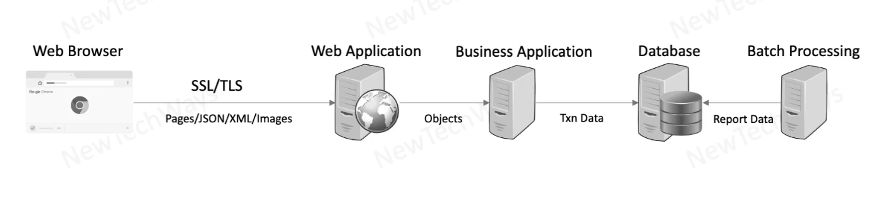

# Section 2: Performance

## Introduction

### Scope 

- Understanding Performance
  - Problems
  - Measurement
  - Principles
- Latency
  - CPU
  - Network
  - Disk
- Concurrency
  - Locking
    - Pessimistic
    - Optimistic
  - Coherence
- Caching
  - Static Data
  - Dynamic Data

**Sample System**

### What is Performance

- Measure of how fast or responsive a system is under
    - A given workload
        - Backend data
        - Request volume
    - A given hardware
        - Kind
        - Capacity

**Goals** 

1. As we increase the workload, performance should stay stable, it should not severely degrate
2. If we increase the hardware capacity, system performance shoould improve

### Performance Problems

How to spot a Performance Problem? How does it look like?

> Every performance problem is the result of some queue building somewhere

> Network socket queue, DB IO queue, OS run queue etc

<b>Reasons for queue build-up</b>
- Inefficient slow processing
- Serial resource access
- Limited resource capacity

Goal: To identify where this build up is happening

---

## System Performance 

### Performance Principles

- Efficiency
  - Efficient Resource Utilization
      - IO - Memory, Network, Disk
      - CPU
  - Efficient Logic
      - Algorithms
      - DB Queries
  - Efficient Data Storage
      - Data Structures
      - DB Schema
  - Caching
- Concurrency
  - Hardware
  - Software
    - Queuing
    - Coherence
- Capacity

### System Performance Objectives

- Minimize Request-Response Latency
  - Latency is Measured in Time Units
  - Depends on
    - Wait/Idle Time
    - Processing Time
- Maximize Throughput
  - Throughput is Measured as Rate of Request
  - Depends on
    - Latency
    - Capacity

### Performance Measurement Metrics

- Latency
  - Affects: User Experience
  - Desired: As low as possible
- Throughput
  - Affects: Number os users that can be supported
  - Desired: Greater than the request rate
- Errors
  - Affects: Functional Correctness
  - Desired: None
- Resource Saturation
  - Affects: Hardware capacity required
  - Desired: Efficient utilization of all system resources

Also

- Tail latency is an indication of queueing of requests
  - Gets worse with higher workloads
- Average latency hides the effects of tail latency
  - Also measure 99 (or 99.9) percentile latency

---

## Serial Request Latency

### Network transfer Latency

- Data Transfer (Global / Regional / Local Network)
  - Data Transfer Latency (wires) in Intranet communication is more reliable and fast compared to Internet
  - Browser -> (Multiple hops in between / Lot of networks, latency) -> Web application (Internet) 
- TCP Connection
  - Latency due to creating of TCP connections, e.g. HTTP is over TCP
  - Overhead: TCP SYN, TP SYN ACK (50ms + 50ms RTT, 1 round trip)
- SSL/TLS Connection
  - SSL is over TCP, overhead much more
    - TCP SYN, TCP SYN ACK,
    - SSL Client Hello, SSL Server Hello
    - SSL Key Exchange, SSL Change Cipher
  - Total 3 round trips

