# Section 3: Scalability


- [Performance vs Scalability](#performance-vs-scalability)
- [Vertical & Horizontal Scalability](#vertical--horizontal-scalability)
- [Reverse Proxy](#reverse-proxy)
- [Scalability Principles](#scalability-principles)
- [Modularity](#modularity)
- [Replication](#replication)
  - [Stateful replication in web applications](#stateful-replication-in-web-applications)
  - [Stateless replication in web applications](#stateless-replication-in-web-applications)
  - [Stateless replication of services](#stateless-replication-of-services)
  - [Database replication](#database-replication)
  - [Database replication types](#database-replication-types)
- [Specialized services](#specialized-services)
  - [Specialized services - SOAP / REST](#specialized-services---soap--rest)
  - [Asynchronous services](#asynchronous-services)
- [Asynchronous processing & scalability](#asynchronous-processing--scalability)
- [Caching for scalability](#caching-for-scalability)
- Database partitioning
  - [Vertical partitioning with micro-services](#vertical-partitioning-micro-services)
  - [Database Partitioning](#database-partitioning)
  - [Database Partitioning selection](#database-partitioning-selection)
  - [Routing with database partitioning](#routing-with-database-partitioning)
- [Methods for horizontal scalability](#methods-for-horizontal-scalability)
- Dealing with large scale systems
  - [Load balancing multiple instances](#load-balancing-multiple-instances)
  - [Discovery service and load balancing](#discovery-service-and-load-balancing)
  - [Load balancer discovery](#load-balancer-discovery)
  - [HLB vs SLB](#hlb-vs-slb)
  - [Layer-7 load balancers](#layer-7-load-balancers)
  - [DNS as load balancer](#dns-as-load-balancer)
  - [Global server load balancing](#global-server-load-balancing)
  - [Global data replication](#global-data-replication)
  - [Auto scaling instances](#auto-scaling-instances)
- Micro-Services Architecture
  - [Micro-Services Motivation](#micro-services-motivation)
  - [Service Oriented Architecture](#service-oriented-architecture)


---

## Overview

- Scalability
  - Vertical & Horizontal Scaling
- Horizontal Scalability
  - Replication
  - Services
  - Caching
  - Asynchronous Process
  - Partitioning
- Load Balancing
  - Load Balancers
  - Service Discovery
  - DNS & Geo Load Balancing
- Micro-Services
  - Architecture
  - Transactions
  - SAGA Pattern
  - NoSQL

---

## Performance vs Scalability

**Fixed Load**

- Performance
  - Low Latency
  - High Throughput
    - Concurrency
      - Single Machine - Multi-Threading
      - Multi Machine - Multi Threading + Multi Processing = Distributed Processing
    - Capacity

**Variable Load**

- Scalability
  - High Throughput
    - Ability of a system to increase its throughput by adding more hardware capacity
  - Both ways - UP and DOWN
 
---


## Vertical & Horizontal Scalability

**Vertical**

- Easier to achieve
- Limited scalability
- Cost raising exponentially
- e.g 4 CPU / 16 GB RAM ➡️ 32 GPU / 256 GB RAM machine

**Horizontal**
- Hard to achieve
- Unlimited scalability
- Cost raising linearly
- e.g. 4 CPU / 16 GB RAM ➡️ 3 x (4 CPU / 16 GB RAM)
- practically immense amount of scalability
- easy to scale down

---

## Reverse proxy

Client having to reach multiple instances of an application, this is only possible if clients can remember the IP addresses of these machines. Those IP addresses are dynamic property and to solve this we use reverse proxy which seats near server side.

- Clint needs to know only about the address of the Reverse Proxy
- Reverse Proxy can also act as a load balancer


**Initial System that we scale**

Web Browser ➡️ Web Application ➡️ Business Application ➡️ Database

---

## Scalability Principles

- Decentralization - Monolith is an anti-pattern for Scalability
  - More workers - Instances, Threads
  - Specialized workers - Services
- Independence
  - Multiple workers are as good as a single worker if they can't work independently
    - They must work concurrently to maximum extent
  - Independence is impeded by
    - Shared resources
    - Shared mutable data

---
  
## Modularity

- Scalable architecture starts with modularity
  - Provides the foundation for breaking an application into more specialized functions / services

Web Browser ➡️ Web Application ➡️ Business Application ➡️ Database

**Business Application**

- API Protocol Layer
- Service Modules
  - User
  - Catalog
  - Order
  - Inventory
- Data Access Layer

Coupled ➡️ Loosely Coupled ➡️ Decoupled

---

## Replication

Web application now has three instances, running exactly the same code
- Stateless / Statefull

Service layer also has 3 instances, running also exactly the same code
- Stateless

Database layer has 2 Databases now, and both have same data
- Stateful

- For handling increasing workloads
  - Stateless
    - Code Replication
    - No data involved in this layer
  - Stateful
    - Code & Data Replication

---

## Stateful replication in web applications

**When low latency is required**

- Sticky sessions / Session affinity
- Sessions occupy memory
- Session clustering for reliability

When first time the request comes, there will be no data in the memory of the web application and we have to go
to the database layer and get the user profile data.

Before giving back the response, we have the opportunity of storing user profile data in the memory of that web application 
instance the request was served

The challenge is that next time the request can go to any web application node ➡️ Solution: Sticky sessions

A cookie exist in the client, that carries the session Id and knows which instance to connect to

**Serious limitations**

- Scalability
  - each session occupies memory
  - maximum number of connections limited by overall memory of the machine
- Reliability
  - if node 1 is no longer alive, where the load balancer should route the request
  - node 3 will have to fetch the information from the database ➡️ high latency, till caches are refreshed
  - changes will be lost in session data ➡️ stale data
    - weblogic provide clustered sessions (copied session data)

In general stateles replication is favoured unless those factors are not considered serious limitations

---

## Stateless replication in web applications

The latency of going to the service may not be that high, but the latency getting data from Database can be very high

- For higher scalability at the expense of higher latency
- Session data can be stored on
  - Client Side in Cookies
  - Server Side in Shared Cache (Memcached / Redis)

preferred architecture, latency cost is only slightly higher

go for stateful architecture when the requirements for latency are extremely critical

---

## Stateless replication of services

**Service Replication**

- Stateless replication - same as web stateless

We can store again in a shared cache data that are frequently read, not frequently modified,
and overcome the latency associated with stateless architecture

When separate instances exist, there is extra complexity because locks cannot be applied. A common technique is to use a lock table in the database.

---

## Database replication

In the context of RDBMS, when the throughput is getting higher we can create a **Read Replica** (Master-Slave configuration). Any change that happens on the primary DB gets automatically propagated and replicated on the Read Replica.

We can also create a **Backup** with replication. If the master goes down, we can promote backup as the master and divert all the traffic load to the new master.

- For higher read scalability
- For high availability


---

## Database replication types

- Master-Slave (Primary-Secondary)
  - Asynchronous - **Read Replica**
    - Low latency writes
    - Eventually Consistent
    - Data Loss
      - In case master goes down, we can promote the secondary as a master but it may result in data loss
    - When we need **high Read Performance**, low latency reads
      - e.g. 5-6 read replicas
  - Synchronous - **Backup**
    - Consistent
    - High latency writes
    - Low write availability
      - if any of both instances goes down, the write operations will have to hold
    - **For backup puproses**
      - e.g. one instance in sync with master which it can replace it in case of failure
  - Common Asynchronous / Synchrous
    - High Read Scalability
    - High Read Availability
    - No Write Conflicts
- Master-Master (No-Master/Peer-To-Peer)
  - Asynchronous - **Multi Geography**
    - Write conflicts
    - High availability
  - Use case
    - High Read Scalability
    - High Read Write Availability
    - Transaction ordering issues


**Master-Slave**

Client can only send read requests to a slave

- Client ➡️ Read + Write ➡️ Master / Primary
- Master / Primary ➡️ Uni-directional Replication ➡️ Slave / Secondary
- Client ➡️ Read ➡️ Slave / Secondary


**Master-Master**

Client can write and read on any of those databases

- Client ➡️ Read + Write ➡️ Master
- Master ⬅️ Bi-directional Replication ➡️ Master
- Client ➡️ Read + Write ➡️ Master

---

## Specialized services

Business application is made of different modules

**Service Modules**
- User
- Catalog
- Order
- Inventory
- Notification

We should be able to add more servers that are dedicated to e.g. host only Inventory module

These issues can be fixed only if we break our monolith application into smaller services

---

## Specialized services - SOAP / REST

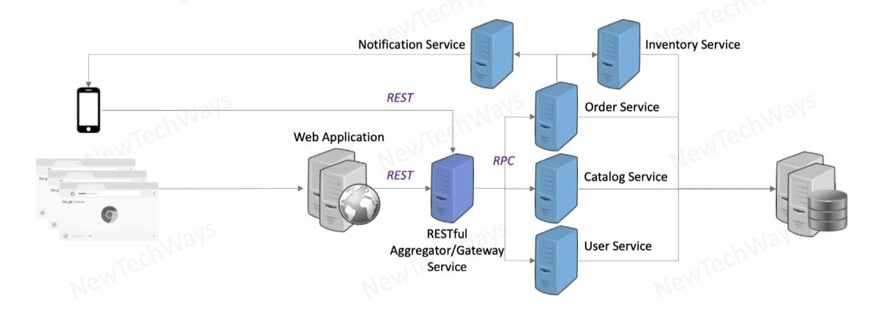

- Partially independent development and deployment
  - e.g. patch only for User Service
- Independent scalability
  - e.g. we can have more number of instances only for a Catalog service
- Independent technology
  - User Service can be a .NET service
  - Catalog a Java Service
  - Order Service in C++

by breaking the monolith application into the business services, we have made some gains in terms of scalability but we have increase the complexity of our system

**RESTful Aggregator / Gateway Service**

- a single point of contact for all of our clients, web / mobile client
- all the background interaction and aggregating the responses will be taken care by gateway service
- we can have an interoperable interface on the gateway
  - we can have gRPC, thrift protocol for internal communication - binary not interoperable, but faster
  - we can have REST protocol for external communication in the gateway


---

## Asynchronous services

We often use message queues to integrate client and server when the interfaces are different and we also use message queues to reliably deliver messages from client to server

- reliable delivery
- integration of different interfaces
- Async services effectively reduces write load from a database

e.g. we want to make order process faster and more reliable ➡️ implement order queue as a buffer

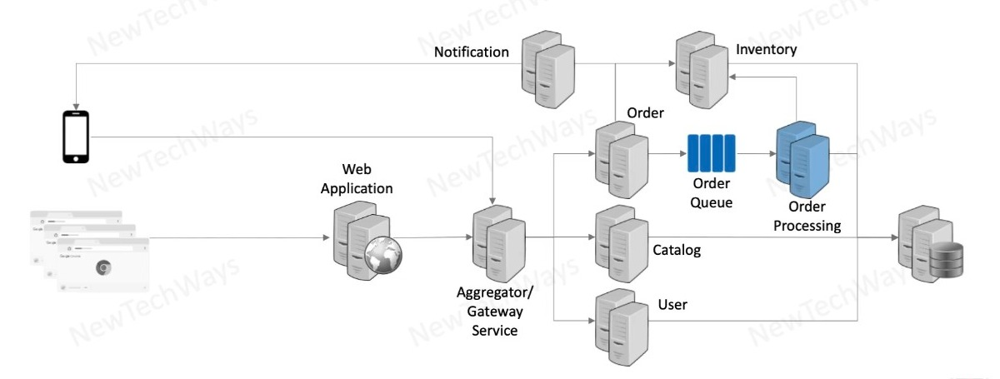

At the order service, we can validate, accept the order and persist it in a message queue

Normally we would process the order but now we are putting it in a message queue (very fast operation)

**Steps involved**

- send a response back to the user when ready
  - that we have accepted the order and we are processing it
  - it is **NOT** the final confirmation that the order has been created
  - it is an acknowledgement that the order has been received
- next step is the order in the messege queue, has to be processed
  - Order processing server
  - it will be notified or pull the orders from the order queue
- order processing server checks the inventory service
- persists the order in the database

We can use asynchronous processing wherever **write operation** is the main operation

---

## Asynchronous processing & scalability

- Async services require infrastructure for average load as opposed to peak load

We want to change the fact that the Database is facing the same load as the Order Service
- The way to do that is asynchronous processing
- the load on our system doesn't remain constant
  - it varies over time
  - peak and down periods
- process requests during low periods of processing

**Example**

- we can scale a db that can process 10000 transactions / seconds to 20000 transactions / second by introducing
  - a message queue
  - an Order Processing Server
- when the overall request rate goes below 10000, during that period the database and order processing server will be able to catch up with the backlog that will be accumulated at Order MQ
- backlog will accumulate during peak periods
- will go away during low periods
- we have distributed the peak load over a period of time
- can work with a lower capacity database
  - but we don't reject any request
  
Order requests ➡️ Order Service PUSH ➡️ **Order MQ** ⬅️ PULL Order Processing ➡️ Order Database

---

## Caching for scalability

- Caching reduces latency and reduces overall read load

**Caching opportunities**

- Data fetched from DB can be cached in Object Cache
- Web application can cache data in Session Cache
- Reverse proxy can cache static data in HTTP Cache
- Browsers or proxies can cache static data in HTTP Cache

Databases are harder to scale because we cannot remove state, that is what it stores

If some of the read load can be served through caches that means we are relieving our database from read load, the additional capacity can be used for write load


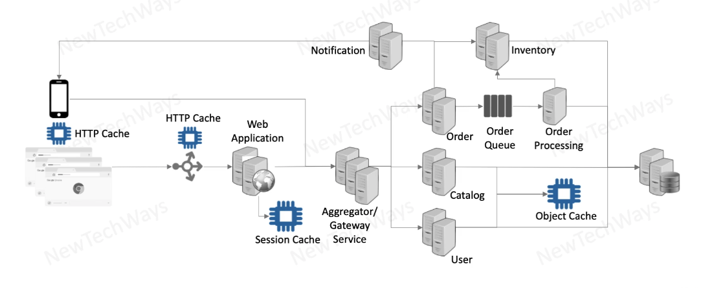


The two ways to scale our database, and our entire system
- caching for read load
- asynchronous processing - message queues - for write load

---

## Vertical Partitioning (Micro-Services)

- Micro-Services completely decouples services and databases for higher scalability
- Can no longer do inter service ACID transactions and need to deal with eventual consistency

In order to scale our database we will have to look at what data the database is storing
- Inventory service
- Order service
- Catalog service
- User service

which represent different business domains in our system. 

We can have separate databases for each domain, we have made our system 4 times more scalable

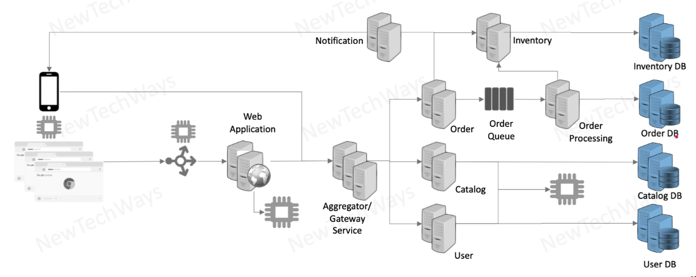

The challenge is if we have common tables, we need to get rid of them, we cannot have common tables, separation of responsibilities

It partitions our database into independent databases and they can take higher write load

---

## Database Partitioning

Database partitioning is used for achieving extreme scalability

### Vertical Partitioning of System

- Catalog
  - DB Node
- Order
  - DB Node
- Inventory
  - DB Node

Splitting database into multiple instances for each domain. This is a vertical partitioning, there is a limit to the extend we can scale.

### Horizontal Partitioning of Database

Splitting of the Order domain into smaller datasets, which we can host into different nodes

**Range Partitioning**

- Order
  - Id 1..100 ➡️ Node 1
  - Id 100..200 ➡️ Node 2
  - Id 200..300 ➡️ Node 3


**Hash Partitioning**

- Order
  - Hash(Id)%N = 1 ➡️ Node 1
  - Hash(Id)%N = 2 ➡️ Node 2
  - Hash(Id)%N = 3 ➡️ Node 3

If we need to rebalance our data (if a node goes down) there is minimum amount of disruption in terms of moving data around


**Common features**

- Partitioning depend on how many nodes we have
  - if we increase / decrease the nodes we will have to change the way we have partitioned the db
  - this is where it's getting complicated
- We **no longer can do ACID transactions**
  - same when they are in different domains
  - we can do only if all records are in the same node
  - in application we have to deal with eventual consistency
  - these are No-SQL databases
  - often RDMS provide also sharding / partitioning
- Makes overall operations more complex because of the added hardware

---

## Database Partitioning selection

Where can we use range and hash partitioning, depends on how we are going to fetch the data

**Range Partitioning**

```
SELECT * FROM Order WHERE id = 150
SELECT * FROM Order WHERE id > 150 AND id < 250
```

- in the second query you have to visit Node 2 and Node 3
- we have to go through a tree like structure in multiple nodes
  - will result to performance penalty

**Hash Partitioning**

```
SELECT * FROM Order WHERE id = 150
```

- we cannot do range queries
- all separate queries will go on separate nodes
- performance of query based of id is must faster than id based query in range partitioning
- hash operation will directly determine the node for the location of key

> Hash partitioning scheme is extremely useful when our access patern of data is predominately on key ids

---

## Routing with database partitioning

**How a database support CRUD operations**

- Client Library (Order Service application)
  - e.g. CouchDB, memcach come with a client library
  - they are cluster-aware, how many nodes in the cluster
  - they apply the hashing algorithm
- Router
  - e.g. MongoDB will provide clients with router component
  - router will determine the node
  - aware of the partitioning scheme
- Go to any node
  - client can contact any node
  - e.g. DynamoDB, CassandraDB
  - that node will take the responsibility of forwarding the request to the correct node

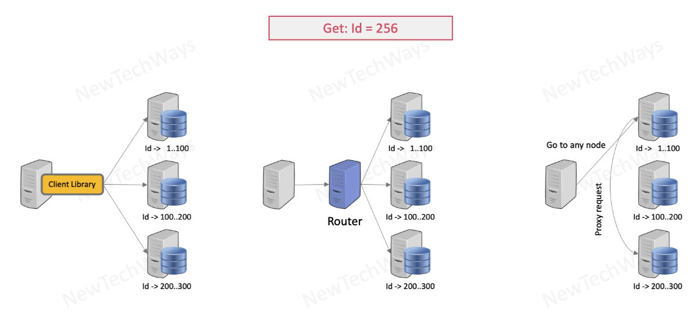

---

## Methods for horizontal scalability

- Services
- Replication
  - Stateful
    - Database can only stateful
  - Stateless
    - Web application or services, can be stateless and are far more scalable
- Partitioning
  - Vertical / Functionality Partitioning
  - Database Partitioning
- Asynchronous Calls
- Caching

---

## Load balancing multiple instances

**Load Balancing**

- Single IP address for a Component
- Load Distribution

A component can have mutliple instances
- Web application
- Gateway service
- Catalog service

The load balancer, if it seats in front of catalog service, it takes the responsibility of routing the requests to the right catalog with a certain stategy (round robin, random). Also, it takes the role of distributing the requests.

The client just connects to the load balancer (1 IP)

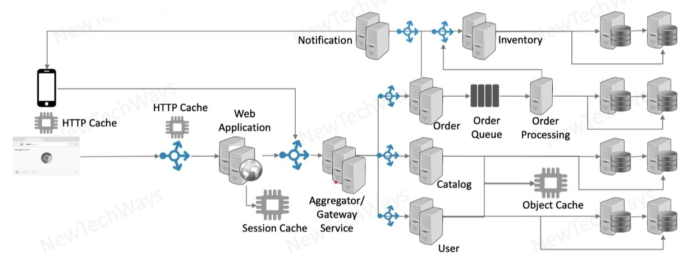

---

## Discovery service and load balancing

- Discovery - Registry for IP of Healthy Instances

Now we have put the load balancers, inside the gateway service. Also, we have added a Discovery Service.

Whenever the aggregator / Gateway Service wants to make a call to any of the backend services, it will make use of the embedded load balancer, which is basically code / a library.

**Discovery Service**

A convenient way of kwoning available services, which are healthy and their IPs

- When an instance comes up will register with the Discovery Service
- Instances will frequently update the Discovery Service with a heart beat
- Gateway service will query Discovery Service for the instances that are available to serve the request
- Gateway service decides which instance to call - based on load balancing strategy

Discovery service can also be of used for the traditional load balancers

Discovery service is present to all large scale systems because the number of instances is very large and dynamic, in K8s it is not needed, but traditionally yes.

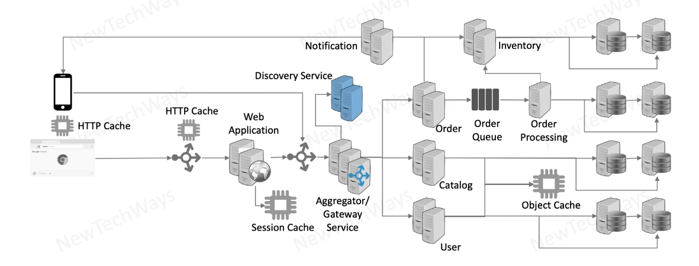

---


## Load balancer discovery

- External Clients - Use DNS to discover the external load balancer
- Internal Clients - Use a local / registry config to discover an discover an internal load balancer

When we connect to a system, we first connect to external load balancer which has an external IP (and an internal IP)

DNS will resolve to the external IP

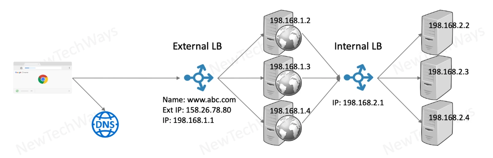

Services and applications will connect to an internal Load Balancer
- they can use registry service and get directly the IP
- if there is a LB, services will connect to that and there will be a config option for this IP in the client

---

## HLB vs SLB

- Hardware Based Load Balancer
  - Load distribution for L4 & L7
  - e.g. F5 Big IP i5000 series
    - Connections: 300 million
    - Throughput: 320/160 Gbps
    - RPS (L7): 10 million
  - very costly
- Software Based Load Balaners
  - Load distribution L7
  - Features
    - Content Based Routing
    - Supports SSL Termination
    - Support Sticky Sessions
  - e.g. Nginx
    - Connections: 225K
    - Throughput: 70Gps
    - RPS: 3 million
  - free
 
If the load justifies software based load balancers, then we can stick to them because they are free and upgrade to HLB if needed

| TCP / IP Model | Protocol | OSI Model |
| -------------- | -------- | --------- |
| Application Layer | HTTP, HTTPS, SMTP, IMAP, FTP, DNS, NNTP ... | Application / Presentation  / Session 'Layer 7' Load Balancing|
| Transport | UDP, TCP, SCTP | Transport 'Layer 4' Load Balancing|
| Internet | | Network |
| Network Access (Link) | Data Link / Physical |

---

## Layer-7 load balancers

**Layer-7 load balancers do several things such as**

- SSL Termination
- Reverse proxy
  - Breaks TCP connection
    - TCP 1 ➡️ LB ➡️ TCP 2-2 Dynamic Content
      - Web application
      - `https://www.hotel.com/reserve`
    - TCP 2 ➡️ LB ➡️ TCP 2-1 Static Content
      - `https://images.hotel.com/room/standard`
    - TCP 3 ➡️ LB ➡️ TCP 2-3 Static Content
      - `https://images.hotel.com/reception`
- Content based routing
  - can look at cookies / body
- Load Balancing
  - Round Robin
  - Least Connection
  - Weighted RR/Least Conn
  - Least Response Time

---

## DNS as load balancer

- Configure DNS records with multiple A records
  - Return single IP in a round-robin fashion
    - e.g. example DNS with 3 records, that results to load balancing
  - Return a list of IP
- Cloud based DNS can be configured along with health checks
  - can ping a backend instance and know about it's health
- Drawbacks
  - Indefinite caching and not respecting TTLs
  - Low or zero TTLs can create a very high load on DNS

A Load Balancer in general is a very active piece of hardware that actively tracks which are the instances that are down, as soon as it discover instances that are down it stops sending traffic to that instance.
- load balancers we want them to have really low TTL values
- DNS TTLs can be high values and that may not be practical

---

## Global server load balancing

We need to update Load Balancer's IP addresses quickly and frequently

DNS as a load balancer acts more like **a router between multiple regions**

- Scalability
  - Routing for multi-geographic systems
- Performance
  - Locally for multi-geographic users
    - Client to Datacenter Latency
    - Client to Datacenter Proximity
    - Datacenter Geography
- High Availability
  - Multi region availability (not a quick switch over)
- Disaster Recovery

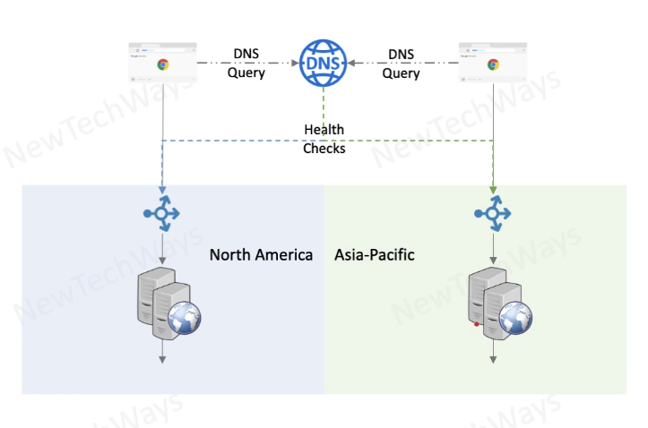

---

## Global data replication

Goal is to ensure data between two datacenters it remains in sync. A user can access the system from any datacenter.

- Active-Active Setup
  - All sites active all the time
- Master-Master or Peer-to-Peer replication
  - Mostly asynchronous
- Failover is quick
- Some data loss is a possibility

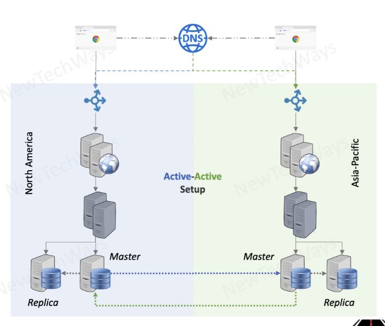


---

## Auto scaling instances

We need a framework which can automatically scale your applications when it senses that is under load.

It needs to be automated because manual processes won't be fast enough to scale in the required time frame, also the chances of any human error go away.

- Monitoring Service
  - Monitor Load
    - CPU
    - Network
    - Disk
  - Monitor Health
    - Ping
    - Http
- Auto-Scaling Service
  - Configure load thresholds
  - Monitor load
  - Launch New Instance
  - Shutdown Instance

**Process**

- Monitoring & Health Check ➡️ 
- Monitoring Feedback ➡️
- AutoScaler ➡️
- Pull out VM/Container image ➡️
- Launch New Instance & Assign IP ➡️
- Register New Instance


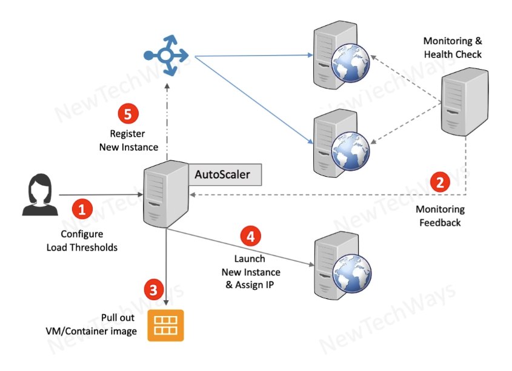

---

## Micro-Services Motivation

Many times we take the middle way of service oriented architecture and micro-services architecture

The most important aspect of any architecture is how it impacts it's and users  in terms of performance, scalability or cost.

**Mirco-Services**

- **High Scalability**
  - Based on Decentralization & Independence
  - **Affects users**
- **Frequent Deployment**
  - Users get incremental / new features at higher frequency
  - **Affects users**
- Independent Deployment
  - Partially release / deploy services
- Independent Development
- Independent Services

---

## Service Oriented Architecture

Before micro-services architecture we had service oriented architecture, which was the usual way of doing services.

To make a system scalable, it should be decentralized and it's components should work independently.

In service oriented architecture, there are independent and not independent entities:

- Independent
  - Each service can have its own technology stack, libraries, frameworks, etc
  - Each service can be scaled independently and differently
- Not Independent
  - Common interface schema
    - XML schema
    - e.g. order data structure is the same in all services
    - services are tightly coupled
  - Common database schema
    - RDBMS schema
    - creates dependencies
- **Issues**
  - Service development may be independent but not the deployment
  - Single database has scalability limitations
    - only vertical scaling

Service oriented architecture can be scaled vertically because database cannot be scaled horizontally

---


