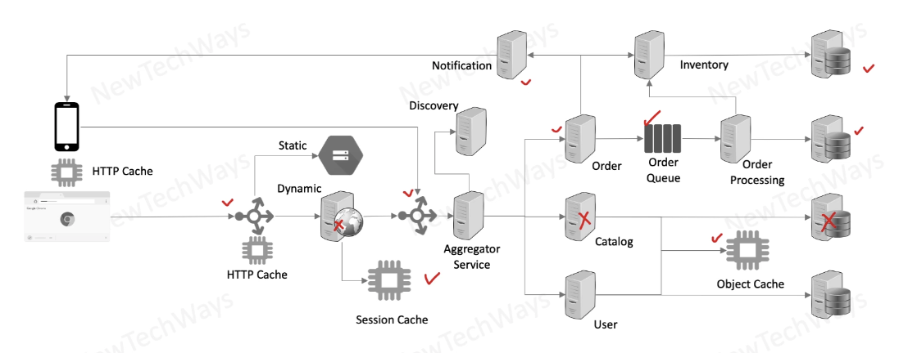
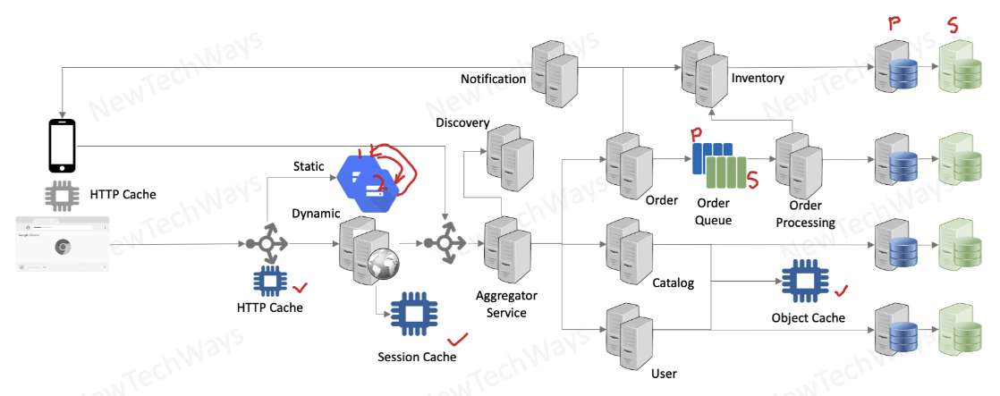
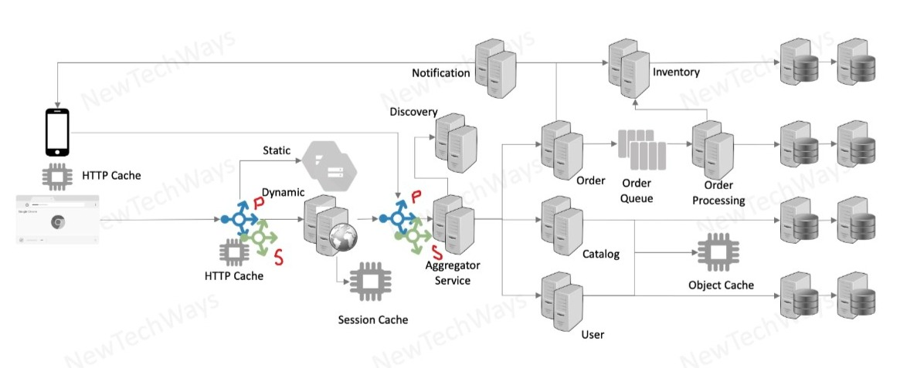

# Section 4: Reliability

- [Module contents overview](#module-contents-overview)
- [Failures in large scale distributed systems](#failures-in-large-scale-distributed-systems)
- [Partial system failures](#partial-system-failures)
- Reliability engineering topics
  - [Reliability](#reliability)
  - [Availability](#availability)
  - [High Availability](#high-availability)
  - [Fault Tolerance](#fault-tolerance)
- Designing Fault Tolerance
  - [Fault Tolerant design](#fault-tolerant-design)
  - [Redundancy](#redundancy)
  - [Types of redundancy](#types-of-redundancy)
  - [Single point of failures](#single-point-of-failures)
  - [Redundancy for Stateless Components](#redundancy-for-stateless-components)
  - [Stateful component redundancy](#stateful-component-redundancy)
  - [Load balancer redundancy](#load-balancer-redundancy)

---

## Module contents overview

**System Reliability**

- Reliability
  - Availability, Reliability
  - Fault Tolerance
  - Partial Failurs
- Designing Fault Tolerance
  - Redundancy
    - Hot, Warm, Cold
  - Fault Detection
    - Health Checks, Monitoring
  - Recovery
    - Stateless, Stateful
- System Stability
  - Timeouts
  - Circuit Breakers
  - Fail Fast, Shed Load

---

## Failures in large scale distributed systems

To make systems horizontally scalable, we need to make them distributed

- Large scale systems are generally distributed systems
  - Large number of components
  - Large number of component instances
- Failures can be
  - Partial
  - Independent
    - e.g. a service component instance goes down
    - requests will be diverted to the other instances
  - Single point of failures
    - e.g. database goes down, it will affect the entire system (except static cached pages)
- Increased chance of partial failures
- Partial failures can lead to complete system failures
  - e.g load balancer fails, no requests will be served by the system

We will look at what kind of failures can happen to the system, how they can impact the system, what are the different architecture principles that we can 
use to make the system more resilient to these failures

---

## Partial system failures

- Network failure - LAN, WAN, Load Balancer
- Machine Failure - CPU, Disk, Memory
- Software Failure - Process
- Disaster - Datacenter
- Operations
  - Deployment Failure
  - Configuration Failure
  - Load Induced Failure
  - External Service Failure

After a point, its much more economical to recover from a failure instead of preventing it altogether

- **No matter how hard we try**
  - **Hardware and Networks will fail**
  - **A changing Software will fail**
  - **Disasters will happen**

---

## Reliability

- A system is said to be reliable if it can continue to function correctly and remain available for operations even in the presence of partial failures
- It is measured as the probability of a system working correctly in a given time interval

---

## Availability

Availability extends the reliability property, refers to the unavailable time

- It is the probability of a system working correctly at any given time and being available for operations
  - Time based availability = uptime / (uptime + downtime)
  - Request based availability = successful requests / total requests
- There can be downtime but the system is expected to recover from the same in a quick time

---

## High Availability

- Availability requirements should come from the impact of availability on a business
- Beyond business, availability is at the cost of
  - New features
  - Operational costs
- The system should use downtimes permitted by SLA / SLO for rollout of new features
  - New feature rollouts invariably cause disruptions

**Availability Requirements**

| Availability | Max Disruption (per year) | Application Categories |
| -----------  | ------------------------- | ---------------------- |
| 99% | 3 days 15 hours | Batch processing, data extraction, transfer, and load jobs |
| 99.9% | 8 hours 45 minutes | Internal tools like knowledge management, project tracking |
| 99.95% | 4 hours 22 minutes | Online commerce, point of sale |
| 99.99% | 52 minutes | Video delivery, broadcast systems |
| 99.999% | 5 minutes | ATM transactions, telecommunications systems |

---

## Fault Tolerance

- Fault Tolerance is a technique to improve Availability and / or Reliability of a system
- It is commonly referred to as an ability of a system to automatically
  - Detect partial failures
  - Handle partial failures
  - Recover from partial failures
- Serviceability
  - The ease with which a system can be serviced in the event of a failure also determines the availabilit of a system

 ---

## Fault Tolerant design

The are three steps in designing a fault tolerant system:

1. Redundancy
2. Fault Detection
3. Recovery

---

## Redundancy

- Replication / Duplication of critical components or functions of a system in order to increase its reliability
- A secondary capacity is kept ready as a backup, over and above the primary capacity, in case the primary is not available

**Example**

It a three tier design: web serverice, business application, database

The single instance of business application goes down and makes the entire application unavailable

We will need to provision redundancy in case the primary instance goes down

---

## Types of redundancy

- Active Redundancy - Hot Spare
  - All nodes do the processing
  - Ideal for providing highest availability
- Passive Redundancy - Warm Spare
  - Only actives nodes do the processing
  - Ideal for quick recovery
  - Redundancy is not in operation 
- Cold Redundancy - Spare (Backup)
  - Spare nodes are brought up only on a failover
  - It is not a high availability option
  - Only when primary instance goes down, we make arrangements to provision secondary capacity
    - There is a significant time delay till second capacity take over
    - low cost option

---

## Single point of failures

A system that has:
- a load balancer for web applications
- a load balancer for microservices
- caches
- message queue
- databases
- service components

If we want to make the system highly available, we need to provision redundancy for these components

If we don't provide redundancy, these components can become single point of failures

For example: 

Catalog database goes down ➡️ Catalog service is down ➡️ Web application will function partially 

If a component fails it may completely affect the system or it can partially affect the system

We need to identify all these components, which can act as a single point of failures and they can compromise the functionality of our system

---

## Redundancy for Stateless Components

We scale stateless components by creating replicas. We use the replication approach to create redundancy for stateless components.

We need to create that many replicas that are **over and above our scalability needs** and it also provides redundancy.

**Example**

We need 2 instances for catalog service. In order to provide redundancy we need one more instance.
If one instance goes down, we have enough replicas to handle the load of catalog service.

Redundancy for stateless components are always **active-active**, because all replicas share the same code.

**Stateless components**
- Web application
- Services

---

## Stateful component redundancy

**Stateful components**
- Databases
- Message Queue
- Object Cache
- Static Content Server

We need to keep data in the redundancy as well, and that is the challenge with stateful components

**Databases**

Create a redundant db instance (Primary, Secondary / Master, Slave)

We want any change in the primary instance to be propagated to the sencondary instance, with:
- Synchronous replication
  - Benefit: DBs will remain in the same state
  - Transactions are atomic
  - Active - Active redundancy
    - switch over will be extremely fast
- Asynchronous replication
  - Benefit: Transactions are fast
  - Transactions are **not atomic**, there is always a delay to the secondary DB in terms of state
  - Active - Passive redundancy
    - Secondary DB will need to sync with the primary based on logs
    - Only then Secondary can be promoted as Primary
    - Switch over won't be quick
  - If the machine of the DB goes down, there is no way for the secondary to catch up with primary
    - We lose data in that case

If we are ready to suffer some data loss, we can have async replication and we get better write speed in terms of transactions

**Message queues**

Exactly the same as database replication (Primary / Secondary). We can have:

- Synchronous replication
  - Active replica
- Asynchronous replication
  - Passive replica

Replications are provided by database vendors or message queue vendors
- As tech architect we need to know what kind of replication / redundancies are being created
  - this is how we get the throughput of the transaction
  - synchronous will slow down the transactions
  - in asynchronous there are chances of losing data 

**Content Server**

Will be handled by the content server

- Data is immutable, no worry about write conflicts
  - e.g. we never modify the uploaded image / always overwrite / update with new image
- Content from one replica will be communicated to the other

**Caches**

We need first to think if we need a redundancy for the cached data

- in case we lose cached data we do not lose them permanently
  - data are persisted in database
- only needed if we are concerned about performance database when cache starts
- `memcache` does not provide redundancy
- `redis` provides redundancy

Load balancers can be configured to cache data through memcache / redis also

---

## Load balancer redundancy

Redundancy of infrastructural components

If we do not provide redundancy for load balancers, they can easily become single point of failure

If the client facing LB goes down, no requests reaches our system

It is critical to provide redundancy for them too with secondary load balancers

---

