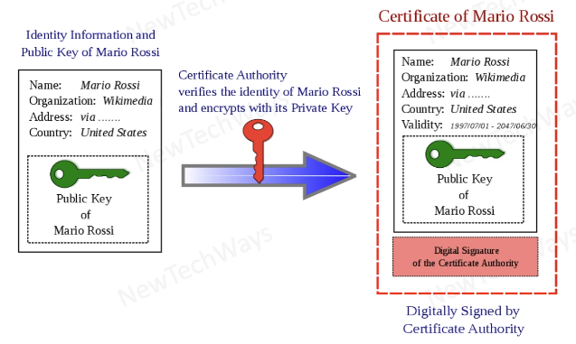
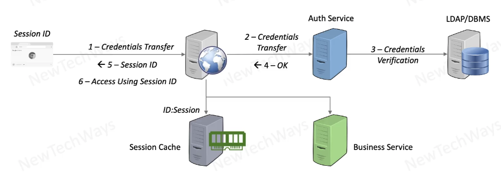
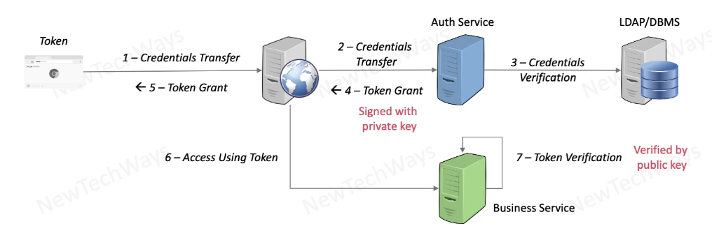
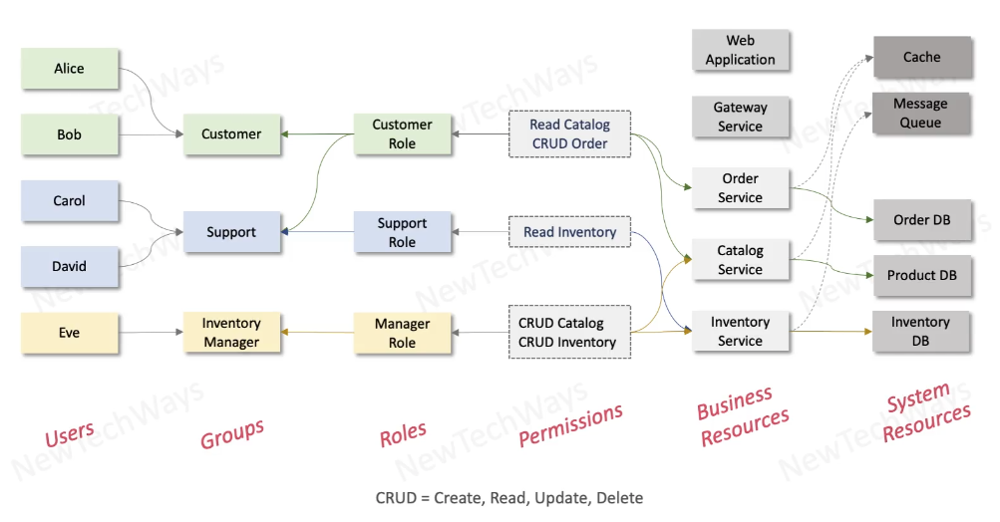
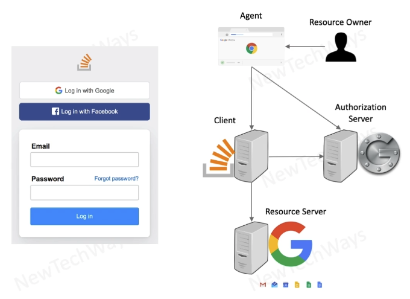
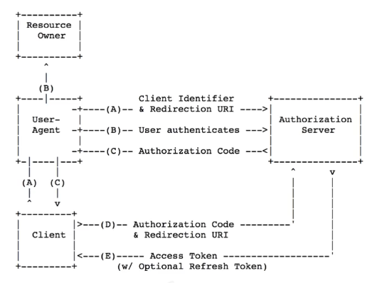
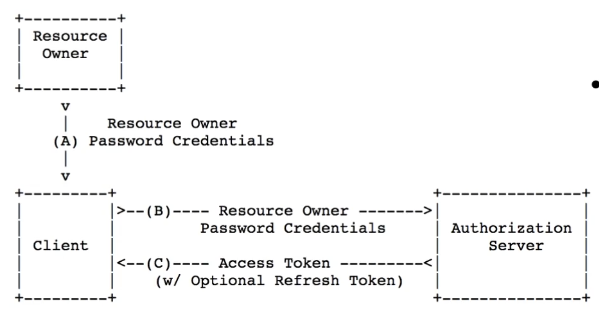
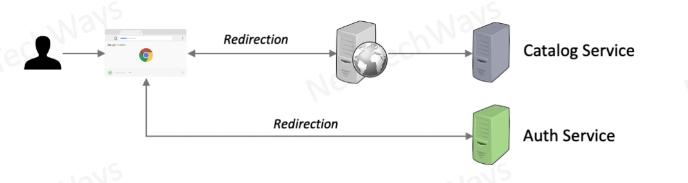
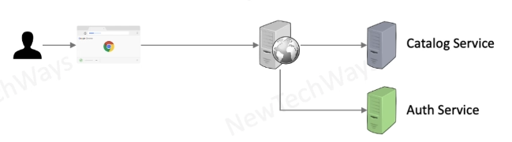
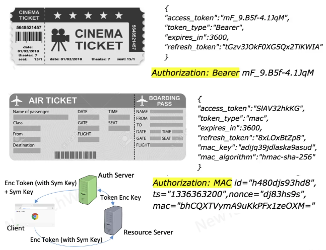

# Section 5: Security

- [Module contents overview](#module-contents-overview)
- [Security objectives](#security-objectives)
- Network Security
  - [Symmetric key encryption](#symmetric-key-encryption)
  - [Public key encryption](#public-key-encryption)
  - [Secure network protocol](#secure-network-protocol)
  - [SSL and TLS](#ssl-and-tls)
  - [Hashing](#hashing)
  - [Digital signatures](#digital-signatures)
  - [Digital certificates](#digital-certificates)
  - [Chain of trust](#chain-of-trust)
  - [TLS / SSL handshake](#tls--ssl-handshake)
  - [Secure network channel](#secure-network-channel)
  - [Firewalls](#firewalls)
  - [Network security](#network-security)
- Identity Management
  - [Authentication and authorization](#authentication-and-authorization)
  - [Authentication](#authentication)
  - [Credentials transfer](#credentials-transfer)
  - [Credentials verification](#credentials-verification)
  - [Stateful authentication](#stateful-authentication)
  - [Stateless authentication](#stateless-authentication)
  - [Single Sign-On](#single-sign-on)
- Access Management
  - [Role based access control model](#role-based-access-control-model)
  - [Role based access example](#role-based-access-example)
  - [Authorization](#authorization)
  - OAuth2
    - [OAuth2 token grant](#oauth2-token-grant)
    - [Auth Code Flow](#auth-code-flow)
    - [Password Flow](#password-flow)
    - [OAuth2 in a system](#oauth2-in-a-system)
    - [OAuth2 token types](#oauth2-token-types)

---

## Module contents overview

**System Security**

- Network Security
  - Public Key Cryptography
  - Digital Certificates & Signatures
  - HTTPS
  - Firewalls
- Identity Management
  - Credential Transfer
  - Credential Verification
  - Credential Storage
- Access Management
  - Role Based Access
  - OAuth2
  - JWT Tokens
  - Token Verification
- Common Vulnerabilities
  - SQL Injection
  - CSS Attacks
  - XSRF Attacks

---

## Security objectives

- Restricted / Private Access
  - control the access to the system
- Identity of Client
- Identity of Server
  - clients should make sure they are connected to the right system
- Encrypted Data
  - Man In The Middle protection
- Client Access
  - access services they have been authorized to
- Service Access
  - allow only required actions from one service to another
- Data Access
  - make sure data are accessed be rightful clients / services
  - no client should not be able to access authorization data of another client
- Data Privacy
  - make sure we are not leaking private data at logs / reports / user interface
  - user credentials, user health related data, financial data, sensitive data
- Identity Storage
- Grant Storage
- Single Sign On
- Common Vulnerabilities

----

## Symmetric key encryption

**Example**: A component in our system is interacting with an external client / or between private components
- Web application working with a browser
- Browser is connected to application through a public Internet
- Everyone has access to the network between the two machines

**Goal**: Make sure the communication between browser / web application remains secure

Can be done with **Symmetric or Single / Secret Key** cryptography

- Key is a set of characters provided by the person who has created the key
- Can be used along with an encryption algorithm to transform plain text into cipher / encrypted text
- In order to read the encrypted text we have to first de-crypt it
- If we use the same key that were used for encryption to decrypt it ➡️ Symmetric Key
- Achieved Privacy / Confidentiality
  - Securely exchanging data between client and server

Any data the browser send can encrypt it using the symmetric key
- anyone in the public network can read this information but cannot make sense of it
- server holds the same key and uses it to decrypt the information

**Limitations**

- We have to share the secret key with untrusted clients

---

## Public key encryption

Also called as Asymmetric or Public-Private Key encryption

- we have two different keys for encryption and decryption / public and private key
- these two keys form a pair and they originate from the same information
- any key can be designated for public or private
- once the private key is designated, we don't share it with anyone else
- we share only the public key

**Scenario 1**

- Take plain text and encrypt it with Public key ➡️ encrypted text
- Encrypted text can only be decrypted by corresponding private key
- Only the holder of the private key will be able to decrypt the message
  - Only the intended recipient have access to the data

**Scenario 2**

- Encrypt text using private key
- Can be converted to plain text by using the corresponding public key
- Only the person who is holding the private key can create this message
  - Identity of a sender, and the integrity of data as sent by the sender
- Anyone who has public key can decrypt this message

We have achieved the following security objectives:

- Privacy / Confidentiality
- Authentication
  - Prove One's Identity
- Non-Repudiation
  - Only the sender (private key holder) could have sent this message

---

## Secure network protocol

Scenario: Web application and browser communicating over the Internet

1. Client initiates SSL / TLS protocol by opting for HTTPS protocol
2. Server transfers it's public key to the browser ➡️ as part of a certificate
3. Client generates a symmetric key ➡️ symmetric key is encrypted using server's public key
4. Encrypted symmetric key is transfered to the server ➡️ server uses it's private key to decrypt it
5. Both client & server have symmetric key and can exchange secure messages over an insecure channel

Encryption algorithms associated with **symmetric** keys are much faster and efficient than the asymmetric key encryption

---

## SSL and TLS

**What we've learned**

- To do secure communication over TCP layer we can use SSL / TLS protocol
- How we can use SSL to create a secure channel

HTTP over SSL ➡️ HTTPS

Many other protocols can be done over SSL like:
- Mail exchanging (POP)
- IMAP
- LDAP
- FTP

**How does a server prove to the client that is a genuine server?**
- Will be part of the certificate

**When a server transfer it's public key via the certificate how does this mechanism works?**
- Related to certificates

The client doesn't need to prove it's identity as part of SSL / TLS

Client provides username / password to the application server, because we have established a secure channel

---

## Hashing

Basic building block of secure communication, widely used in digital signatures and digital certificates.

- Generates a value or values from a string to text using a mathematical function
  - MD-5 (Message Digest)
    - 128 bits
    - Has collision vulnerability
  - SHA-1 (Secure Hash Algorithm)
    - 160 bits
  - SHA-2 (used predominately)
    - 156, 512 bits
- Generates same output for same text
- Hashing is a one-way althorithm
- Slightest change in the text changes the hash value drastically

Ensures integrity of messages

---

## Digital signatures

Digital signatures are a way of validating authenticity and integrity of a message or a document.

- Encrypted hash of a message
- Encrypted using signer's private key
- Verified using public key of signer
- Message is hashed independently, and compared with the hash present in the signature
- like psysical signatures establish the validity of a document
  - tells us who has signed the document
  - tells us that the content of the document is not tampered by anyone

**Algorithm for Signing**
- A signer will generate the hash of the entire document (document is not a secret)
- The signer will use it's private key to encrypt the **hash code**
- We combine the original document and the signed signature in one single document
- The certificate is a way of providing the public key
- Send it to the receiver

**Algorithm for Verification**
- The receiver will split the data and the signature
- It will compute the hash of the document
  - hash function will be provided along with the signature
- Receiver will use the public key to decrypt the signature

If the hashes are equal, the signature is valid.

Ensures: Integrity, Authentication, Non-repudiation

---

## Digital certificates

Digital certificates is a way of providing the public key to our clients

- Way of sharing public key with the world, in a trusted manner
  - Any client should be able to verify who the public key owner is

**Example**

- Organization owned by Mario Rossi
- Mario Rossi will go to the digital authority
- Will request for a digital certificate which is a document that has
  - the public key
  - identifying information of public key's owner
  - validity attribute to the certificate / from - to date
  - CA will use it's private key and will digitally sign the document
- Certificate can be hosted on a website
- When a client makes a secure connection, the certificate will get downloaded on client's machine
- That client will verify the digital signature
  - Will need the public key of the Certifying Authority (Group CA)
  - Their public keys are pre-install in the OS and browser can use
  - The client will decrypt the signature
  - Will get the hash of the entire document and match this with the hash provided in an encrypted form
  - If they match that means the information provided is correct

---

## Chain of trust

We made an assumption that the certificate was signed by root Certifying Authority
- it is generally signed by a Tier 2 / 3 / 4 Certifying Authority

**Example of CA Hierarchy of Trust**

- Root CA (company like Verysign)
  - Root CA can authorize another set of companies
  - Tier 2 Certifying Authorities
    - can authorize Tier 3 Certifying Authorities
    - Tier 3 CA

**Example: we have a certificate from a Tier 2 CA**

- In order to verify this signature our clients will need public key of the Tier 2 CA
- This certificate has a reference to another certificate which was issued by root CA
  - Root CA's name
  - Root CA's public key
  - Root CA's signature
- Browser will pull out the public key of the root CA e.g. Verysign (stored in OS)
- It will validate the Root certificate by validating the signature
- It will go back to the Intermediate Certificate
  - has Public key of the Intermediate Certificate
  - It will use the public key to verify that signature
- It will peak up the trusted public key of the End-entity website

---

## TLS / SSL handshake

**Protocol**

- A client initiates a secure connection with the server
  - **Client Hello Request**
  - Accompanied with browsers capability of encryption algorithms that supports
- Once a server receives this request
  - It sends in it's response the Public Key by means of **Digital Certificate**
  - Let's the client know what encryption algorithms it can support out of what client has requested
  - Can also ask client's certificate (optional) - not always possible / can use application authentication
- The client **verifies the Certificate** and it extracts Public Key out of it
- The client **generates a symmetric key** and encrypts it using the Public Key it has extracted
  - The symmetric key is sent to the server
- The **server extracts the symmetric key** out of the encryption by using the Private Key
- They are ready to communicate using the secure channel

---

## Secure network channel

We've learned that we can use TLS communication over the Internet, for that:

- Certificates & keys are deployed on external load balancers
  - Digital Certificates and Private Keys used for creating TLS communication
  - More convenient way to put those in load balancers because e.g. web application may need to scale
- TLS connection is terminated in the external load balancer
- The rest communication in the Intranet happens on http
  - non-secure communications are faster
  - if it is needed though we can use TLS in the Intranet too
  - we can use internal certificates

---

## Firewalls

We do not want any external entities to access our Intranet. Sometimes we need to deny certain origins from our application.

Firewalls are a network component that can sit between our system and the clients
- they can look if the request coming from a client it's permitted or not

**Firewalls properties**

- Function
  - Allow
  - Deny
- Ingress Config
  - Source IP (Range)
  - Target IP (Range)
  - Target Port
  - Protocol
- Egress Config
  - Destination IP (Range)
  - Target IP (Range)
  - Target Port
  - Protocol

---

## Network security

We have divided our application into 4 subnets. 

A subnet is a a range of IP addresses within a network.

We have allowed access to external application into
- DMZ - Subnet 1
  - only TLS port 443
- DMZ - Subnet 2

The other subnets are only for the applications that belong to our Intranet
- Services Subnet
  - only opened Port 8080
- DB Subnet
  - only Port 1522

DB Subnet can only be accessed by Services subnet, not even from web application. because it is not needed.
Access should be granted in need base only

There is no access that we do not understand or we do not anticipate, only selective access which provides full network security

---

## Authentication and authorization

- Authentication
  - Providing an identity
      - ID
      - Name
      - Organization
    - Who you are
- Authorization
  - Providing right to access
    - Functions / Services
    - Data
  - What you an do

---

## Authentication

As part of authentication we will discuss
- Stateful Authentication
- Stateless Authentication

then we will discuss how
- Credentials transfer
- Credentials Verification
- Credential Storage in Client
- Credential Storage in Server

---

## Credentials transfer

How credentials are transfered from client to the server, when the client tries to authenticate itself

- HTML Forms
  - HTTP Post method over SSL / TLS
  - this method is used when a human is interacting with the system / not programmating access
- HTTP Basic
  - Based on Challenge-Response
  - HTTP Methods over SSL / TLS
  - Base 64 encoded UserId:Password
- Digest Based
  - Like Basic but uses hashed password
  - Hash = MD5 (username: realm :password)
- Certificate Based
  - Private-Public key-based certificates exchanged

---

## Credentials verification

2 set of information that we want to store
- User Auth ➡️ ID, Name, Role, Group
- User Info ➡️ Org, Address, Contact, ...

**Credential verification options**

- File Storage
  - Not scalable
- Database
  - RDBMS
  - NoSQL
- LDAP / Directory Server
  - Architecture
    - Hierarchical database designed for reading, browsing, searching organization data
      - Store user information in a tree format
    - High scalability and high performance for read loads
  - Environment
    - Enterprise environment with multiple applications
    - Interoperability with all LDAP clients
    - Distributed / Federated storage

---

## Stateful authentication

- Limited Scalability due to Sessions and Centralized Authentication
- Sessions can be revoked by removing it from the session storage
  - Benefit if the session has been compromised

**Process**

1. Credentials Transfer
   - the system will receive username and password through a POST HTTPS form
2. Credential Transfer
   - will pass the credentials to the Auth Service using HTTP method
3. Credentials Verification
   - will fetch user details from LDAP / DBMS
4. Outcome will be sent to web application
5. Web application will create a Session ID
   - every user connected will create a session in the web application memory
   - can lead to memory load / routing problems
   - If multiple instances of web applications exist, **will use a common Session Cache**
     - stores Session objects, can scale seperately
     - new component introduced
6. Access Using Session ID
   - next time user tries to connect, sends the session ID in the cookie
   - can pass the request to the Business Service

---

## Stateless authentication

- Signed or encrypted tokens with {Id, Name, Role, ...}
- Decentralized Authentication leads to better scalability
- Requires centralized store for immediate token revocation

Auth process is the same as in stateful authentication. The difference is that the auth Service generates a token which is provided to the client.

Next time the browser sends a request it will accompanied with a token in the cookie
- Business Service will receive the token that was created by Authorization Service
- Business Service can verify the signature of the token by using the public key

---

## Single Sign-On

Single sign-on using stateless authentication

- A web or mobile client are connecting to the system for the first time
  - They are routed to the Auth Service
  - Auth Service provides them a token
- Mobile client can go directly to the Gateway service
  - Doesn't need to go to the web application
  - For the web browser it makes sense to have the Web App as the access point
    - but for AJAX calls within browser we cal also go to the Gateway Service directly
- Services will do the validation of the token
  - will extract authentication / authorization information
  - the methods is using authorization header in the HTTP request
  - if we are using hyperlinks we can pass the token as a cookie

---

## Role based access control model

We want to allow users to perform only those specific actions that we want them to allow to.

We do this by defining Role based access control model for a system.

**Who**

- Identity
  - User Id
- Identity Group
  - Set of User Ids

**Can do what**

- Permission
  - Allowed Operation
- Role
  - Set of Permissions

**Of which Resources**

- Resources
  - Service API

We assign roles to User Groups. We avoid assigning roles to user ids because that is an administrative overhead.

The resources allow only those users who have the particular role 
- that role must have the right permission required to access the resource

---

## Role based access example

---

## Authorization

Authorize clients for large scale systems where we can use stateless authentication

Authorization server and resource server can be in different locations
- e.g. Stackoverflow login with Google account

**Options**

- OAuth2
  - Token Grant
    - OAuth2 grant allows clients to access a protected resource on behalf of a resource owner
    - Specifications do not specify how Authentication is done
  - Token Types - Bearer, MAC
  - Token Format Types - JWT, SAML
- API Key
  - Mostly used by server applications
  - Provides access to APIs of other services
    - Purpose is to identify the origin of a request
      - Valid only for a Domain or IP
    - Doesn't matter who the user is
  - Example - API Key for Google maps

---

## OAuth2 token grant

- Resource Owner
  - User with access to resources
- User Agent
  - User's HTTP Browser
- Client
  - Application that needs access to user's resources
- Authorization Server
  - Identity Provider
- Resource Server
  - Host's user's resources
  - Any client with user access token can access user's resources

---

## Auth Code Flow

Resource Owner using User-Agent (browser) goes to client's website and wants to login e.g. with Google identity

A. Client will redirect user to the Authorization Server (with list of resources that needs to be authorized)

B. User authenticates with the user / password form that Authorization server send back

C. Authorization Server will generate an Authorization Code and will give it to User-Agent /  will be redirected to client

D. Client takes the Authorization Code to Authorization Server (uses it's own login mechanism)

E. Authorization Server will respond back to client with an Access Token. Will authorize client to access the resources listed in the request

---

## Password Flow

- A. Client is trusted to receive user (resource owner) credentials
- B. Client passes user credentials to authorization server
- C. Client receives access token that has authorization information

---

## OAuth2 in a system

**Code flow**

- web applicaton will redirect user to the auth server
- auth server will make us to login
- auth server will redirect us - after verifying information - to web application
- web application will get the token to access catalog service

**Password Flow**

- use tries to access web application
- it will go to auth service - with username, password - and will get a token in return
- can access catalog service

---

## OAuth2 token types

Different type of tokens that OAuth2 can handle

- Bearer Token
  - Any who has the token client can use it
  - Only Integrity Protection
  - Requires TLS for Confidentiality
- MAC Token (Holder-of-the-Key)
  - Integrity Protection and Data Origin Protection
    - A client for which this token was issued can only use it
  - Can work without TLS
    - Requires TLS for getting access token from auth server
  - Both client and server needs to possess a secret symmetric key
  - Auth server and Resource server agree on a token encryption key

---

