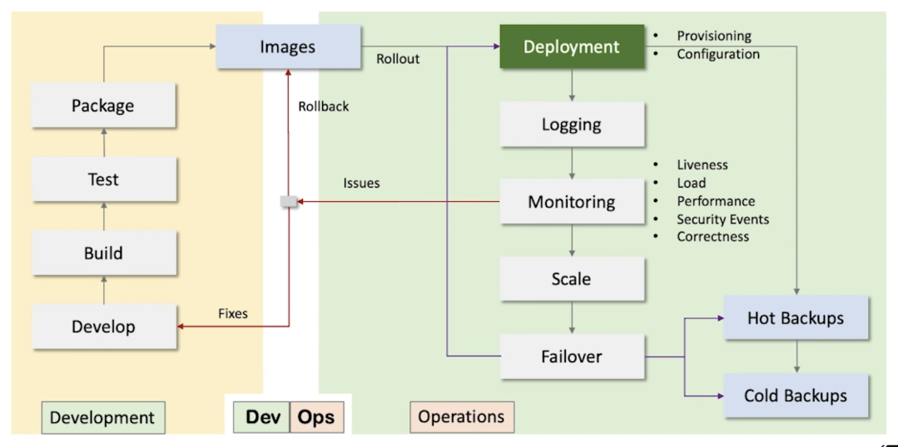

# Section 6: Deployment

- [Module contents overview](#module-contents-overview)
- [Large scale deployment challenges](#large-scale-deployment-challenges)
- [Application deployment](#application-deployment)
- [Infrastructure deployment](#infrastructure-deployment)
- [System operations](#system-operations)
- [Modern deployment solutions](#modern-deployment-solutions)

---

## Module contents overview

**System Deployment**

- Deployments
  - Application
  - Infrastructure
  - Operations
- Large-Scale Deployments
  - Virtual Machines
  - Docker Containers
  - Kubernetes
- System Upgrades
  - Rolling Upgrades
  - Blue-Green Deployments
  - Recreate Deployments
  - Canary Deployment
 
---

## Large scale deployment challenges

- Application Deployment
- Infrastructure Deployment
- Operations

---

## Application deployment

In Large scale systems we deal with lots of components which need to be replicated for scalability and reliability, that makes the deployment process complex.

- Web Apps
  - Replicas
- Services
  - Microservices & Replicas
- Databases
  - RDBMS, NoSQL
  - Replication & Partitioning
- Message Queues
  - Replication & Partitioning
- Caches
- Directory Servers / LDAP
- Content Storage
- Log File Storage
- Search & Analytics

Deployment is not a one-time activity. It is continuous
- Upgrades
- Bug Fixes

---

## Infrastructure deployment

Application can be deployed on top of this infrastructure

- Compute Infrastructure
  - Compute VMs
    - CPU, RAM, Disks
- Network
  - Routing, Domains
    - Datacenters
  - Internet access
  - Secure access
    - Firewalls, Certificates
- Load Balancers
  - HSL, SLB
- DNS & Discovery Services
- Storage
  - Content, VM / Container
  - Images, Backups, Logs
- Mail Servers
- CDN

We need to provision adequate capacity of infrastructure so that our system can function and scale
when required

Also we need environments for
- Dev
- Test
- Staging
- Prod

---

## System operations

How can we architect our system so that operations run smoothly 

We are looking at engineering solutions which can facilitate these automated operations

---

## Modern deployment solutions

Any deployment process is all about automating the manual steps

- Application Deployment
  - Containers
    - Docker
- Infrastructure Deployment
  - Cloud
    - Google Cloud, AWS
- Operations
  - Kubernetes
- Automation
  - DevOps Tools
    - Vargrant, Ansible, CHEF

---

