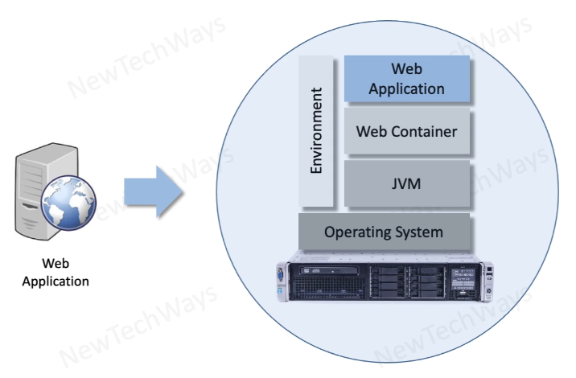
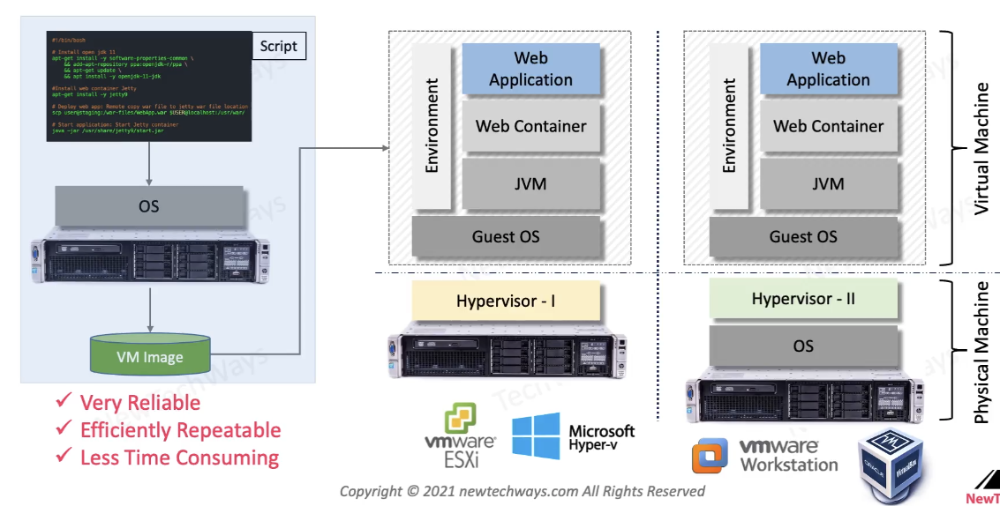
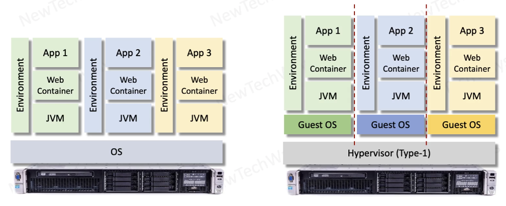
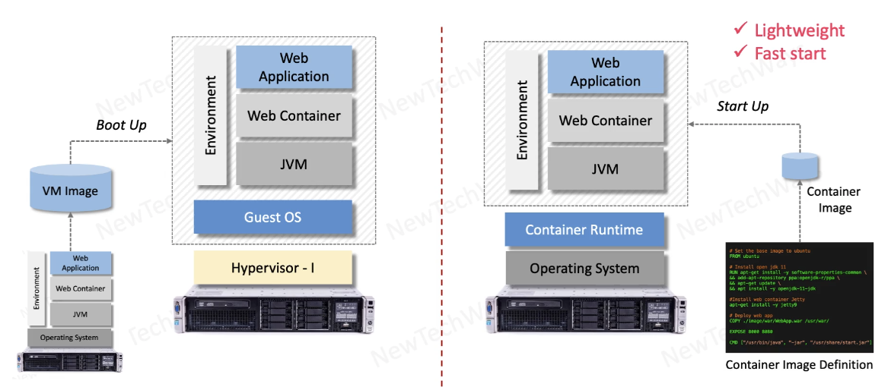
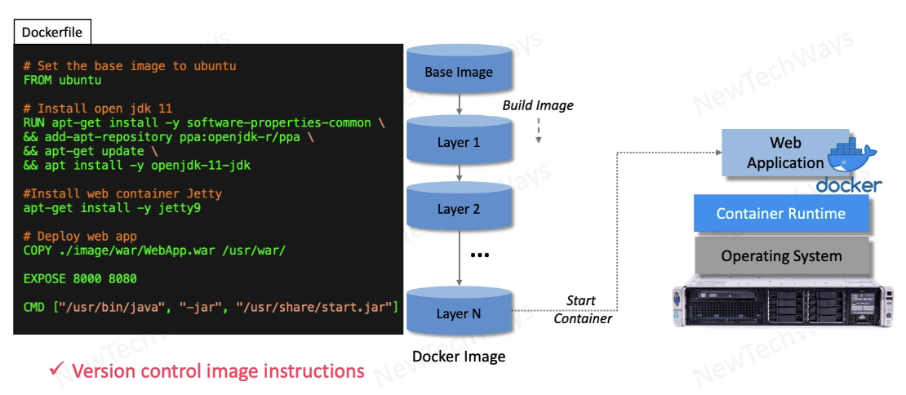
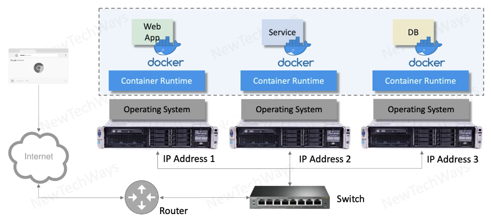
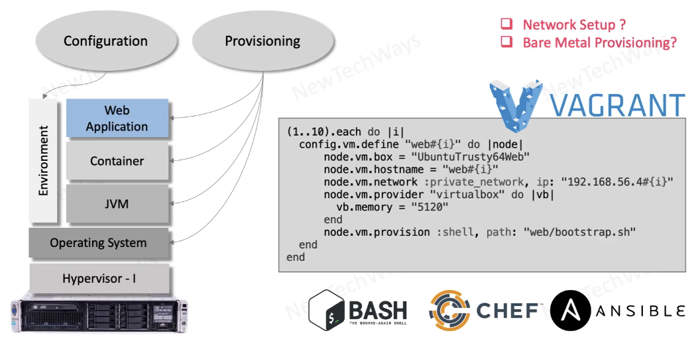
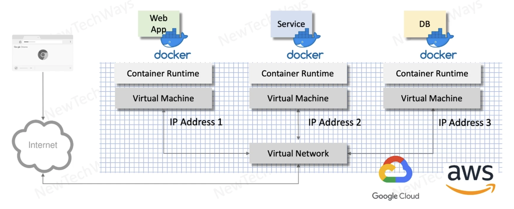

# Section 6: Deployment

- [Module contents overview](#module-contents-overview)
- [Large scale deployment challenges](#large-scale-deployment-challenges)
- [Application deployment](#application-deployment)
- [Infrastructure deployment](#infrastructure-deployment)
- [System operations](#system-operations)
- [Modern deployment solutions](#modern-deployment-solutions)
- Application Deployment
  - [Component Deployment](#component-deployment)
  - [Component Deployment Automation](#component-deployment-automation)
  - [Deployment with Virtual Machines](#deployment-with-virtual-machines)
  - [Isolation through virtual machines](#isolation-through-virtual-machines)
  - [Deployment with Containers](#deployment-with-containers)
  - [Docker containers](#docker-containers)
- Infrastructure Deployment
  - [Infrastructure requirements](#infrastructure-requirements)
  - [Provisioning and configuration](#provisioning-and-configuration)
  - [Deployment with containers on Cloud](#deployment-with-containers-on-cloud)
  - [Deployment with AWS cloud stack](#deployment-with-aws-cloud-stack)

---

## Module contents overview

**System Deployment**

- Deployments
  - Application
  - Infrastructure
  - Operations
- Large-Scale Deployments
  - Virtual Machines
  - Docker Containers
  - Kubernetes
- System Upgrades
  - Rolling Upgrades
  - Blue-Green Deployments
  - Recreate Deployments
  - Canary Deployment
 
---

## Large scale deployment challenges

- Application Deployment
- Infrastructure Deployment
- Operations

---

## Application deployment

In Large scale systems we deal with lots of components which need to be replicated for scalability and reliability, that makes the deployment process complex.

- Web Apps
  - Replicas
- Services
  - Microservices & Replicas
- Databases
  - RDBMS, NoSQL
  - Replication & Partitioning
- Message Queues
  - Replication & Partitioning
- Caches
- Directory Servers / LDAP
- Content Storage
- Log File Storage
- Search & Analytics


Deployment is not a one-time activity. It is continuous
- Upgrades
- Bug Fixes

---

## Infrastructure deployment

Application can be deployed on top of this infrastructure

- Compute Infrastructure
  - Compute VMs
    - CPU, RAM, Disks
- Network
  - Routing, Domains
    - Datacenters
  - Internet access
  - Secure access
    - Firewalls, Certificates
- Load Balancers
  - HSL, SLB
- DNS & Discovery Services
- Storage
  - Content, VM / Container
  - Images, Backups, Logs
- Mail Servers
- CDN

We need to provision adequate capacity of infrastructure so that our system can function and scale
when required

Also we need environments for
- Dev
- Test
- Staging
- Prod

---

## System operations

How can we architect our system so that operations run smoothly 

We are looking at engineering solutions which can facilitate these automated operations


---

## Modern deployment solutions

Any deployment process is all about automating the manual steps

- Application Deployment
  - Containers
    - Docker
- Infrastructure Deployment
  - Cloud
    - Google Cloud, AWS
- Operations
  - Kubernetes
- Automation
  - DevOps Tools
    - Vargrant, Ansible, CHEF

---

## Component Deployment

Example: Web Application

- Process
  - Install JVM
  - Install Web Container
    - Configuration
  - Deploy Web App
    - Configuration
- Issues
  - Error Prone
  - Time consuming
  - Repetitive
 


---

## Component Deployment Automation

- Provision a machine with required operating system
- Run a script to install the required software

Benefits
- Reliable
- Easily repeatable
- Less time consuming
- Idempotent
- Declarative
- Remote

Example
```
#!/bin/bash

# Install open jdk 11
apt-get install -y software-properties-common \
&& add-apt-repository ppa:openjdk-r/ppa \
&& apt-get update \
&& apt install -y openjdk-11-jdk

# Install web container Jetty
apt-get install -y jetty9

# Deploy web app: Remote copy war file to jetty war file location
scp user@stagin:/war-files/WebApp.war $USER@localhost:/usr/war/

# Start application: Start Jetty container
java -jar /usr/share/jetty9/start.jar
```

---

## Deployment with Virtual Machines

We can take the component deployment one step further by doing **Virtualization of application components**

We can install Virtual Machine software and we can use it as an image along with the Operation System
- then we take that image to a different machine (running virtual machine software)
- efficient way of repeating the installation

Application had some dependencies on
- OS Version
- exact environment of OS

we have lifted the entire environment and we have completely minimized any chance of incompatibility
- very reliable
- efficiently repeatable
- less time consuming

**Two ways of running a Virtual Machine**
- Using Hypervisor - Type I
  - efficient, typically used in cloud
    - vmware ESXi, Microsoft Hyper-v
    - Bare Metal
    - No underlying OS between hypervisor and physical machine
- Using Hypervisor - Type II
  - Install Virtualization software
    - vmware
    - VirtualBox
  - 2 OSs



---

## Isolation through virtual machines

There is no fixed requirement of any application in terms of Operating System resources like CPU, RAM, disk etc

A good strategy is to buy a large piece of hardware and run multiple applications
- Issue: Hardware is shared across multiple applications
  - e.g. if application 1 runs a batch process it may hog the entire CPU
  - applications 2,3 which are client facing may slow down requests

We can overcome this issue by running Virtual Machines
- fixed quota of resources are allocated to each VM
- No shared resources between applications running virtual machine on the same host machine



---

## Deployment with Containers

**Containers vs Virtual Machines**

- The way we create images
- VMs are heavy
- VMs include the Operating System
- Container image only needs instructions and Docker converts those into a Container Image
- Container image does not contain the Guest OS
  - Only system libraries for this OS (lightweight)
  - Start up is very fast (no OS)
  - All system calls go through Container Runtime
    - Container Runtime will convert those to System calls

**Containers Advantages**
- Container image is light weight and can be install easily
- Container start up time is fast



---

## Docker containers

**Dockerfile**

Similar to shell script, slightly different


```
#Set the base image to ubuntu, will be downloaded from docker registry
FROM ubuntu

# Install open jdk 11
RUN apt-get install -y software-properties-common \
&& add-apt-repository ppa:openjdk-r/ppa \
&& apt-get update \
&& apt install -y openjdk-11-jdk

# Install web container Jetty
RUN apt-get install -y jetty9

# Deploy web app
COPY ./image/war/WebApp.war /usr/war/

EXPOSE 8000 8000

CMD ["/usr/bin/java", "-jar", "/usr/share/start.jar"]

```




This file now can be put to version control

If only corrections are made, we can reuse the previous images (docker automatically do that).

---

## Infrastructure requirements

As part of infrastructure we need to make sure that we have **host machines** that we can run application components.

The next thing is how to connect these machines by a network so that external clients can connect to our system through Internet and internal clients can communicate with each other.
- we give IP addresses to these machines as we connect them to a network

We may need load balancers for applications, firewall for the system.

**3-tier system**




---

## Provisioning and configuration

When we have to deploy a system on a premises environment, in a traditional way without docker containers.

Example: deploy a web application on 10 different nodes

We can use Vagrant, requires to write a Ruby application when we specify infrastructure as code

```
(1..10).each do |i|
  config.vm.define "web#{i}" do |node|
    node.vm.box = "UbuntuTrusty64Web"
    node.vm.hostname = "web#{i}"
    node.vm.network :private_network, ip: "192.168.56.4#{i}"
    node.vmprovider "virtualbox" do |vb|
      vb.memory = "5120"
    end
    node.vm.privision :shell, path: "web/bootstrap.sh"
  end
end
```

`web/boostrap.sh`: script installs all the components once a node or a VM is allocated



Assumes the availability of engineers who can setup network
- then we can use DevOps tools like Vagrant, Chef, Ansible to do provisioning and configuration

---

## Deployment with containers on Cloud

We have replaced physical hardware, compute hardware and network hardware with
- Virtual Cloud Machines
- Virtual Cloud Network

much simpler than having to manage physical machines or a network

Virtual machines can be created by issuing just a command
- we can create a script which can create thousand of Virtual Machines in no time
- we can create Virtual Networks by using a script

The entire infrastructure is replaced by an infrastructure which can be created through a script
- Infrastructure as Code
- Can be done in no time (biggest achievement)



---

## Deployment with AWS cloud stack

**Reasons to migrate to the cloud**

- Compute VM
  - On Demand
  - Multiple global locations
- Serverless Compute
- Network
  - Global Connectivity
  - Firewalls
- Fully Cloud Managed Services
  - Load Balancers
    - External, Internal
  - Databases
    - RDBMS, NoSQL
  - Storage
    - Content, Backups
  - Logging & Monitoring


---
  


