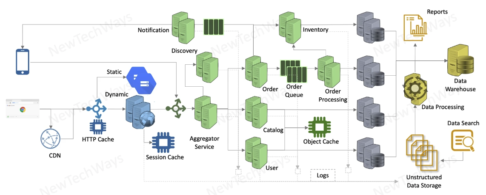
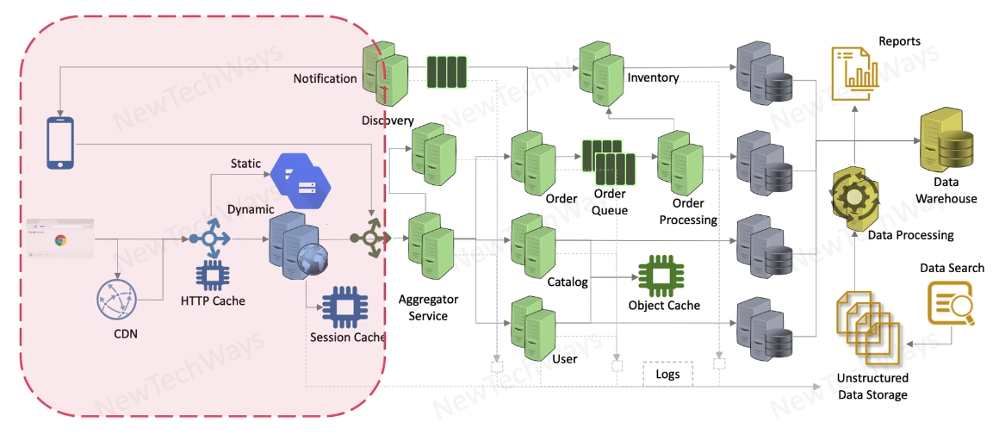
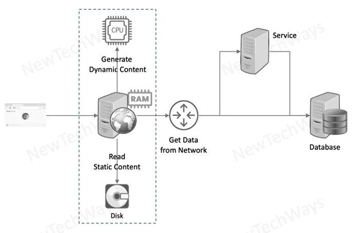
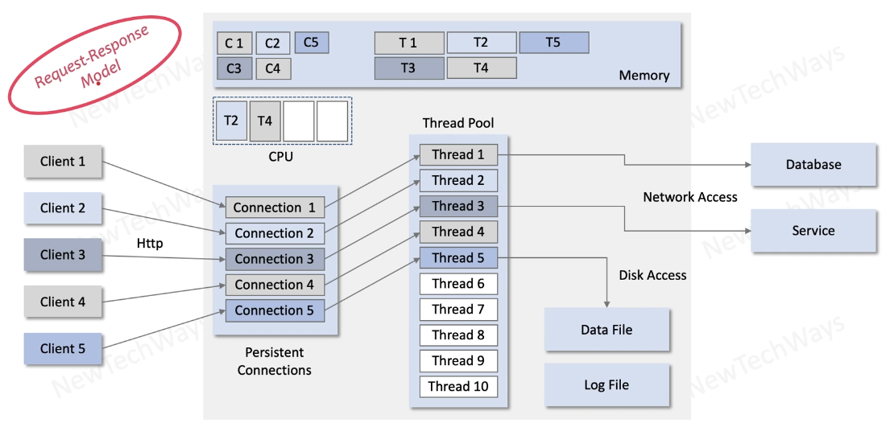
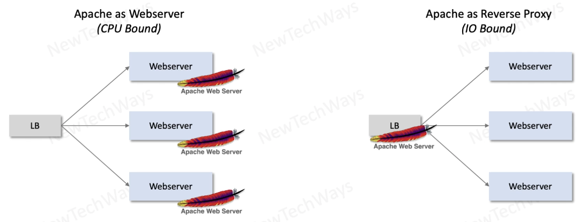
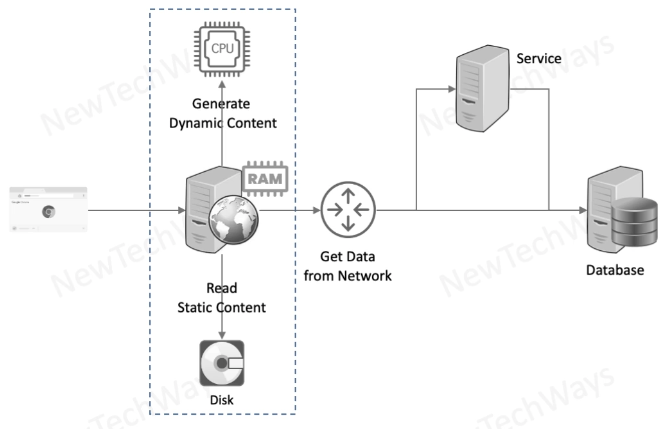
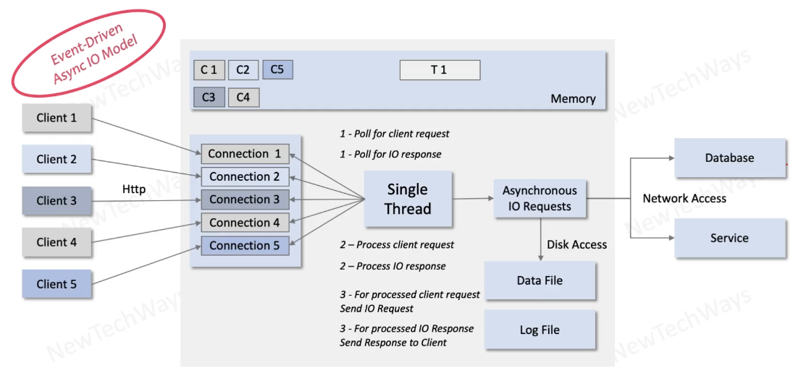
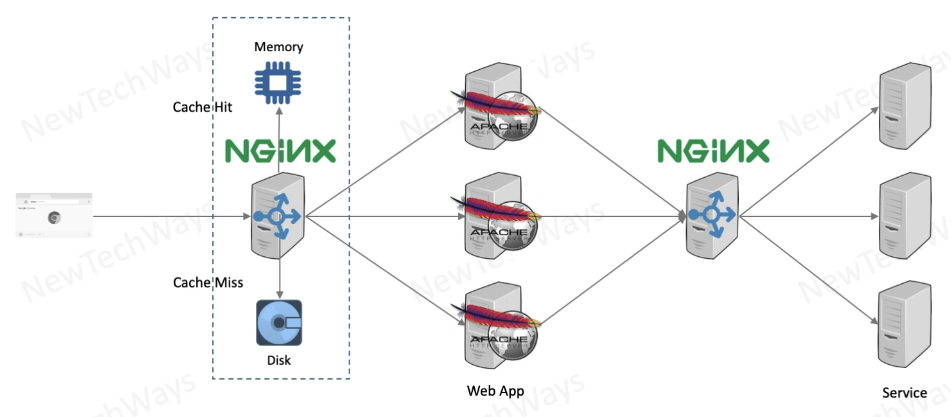
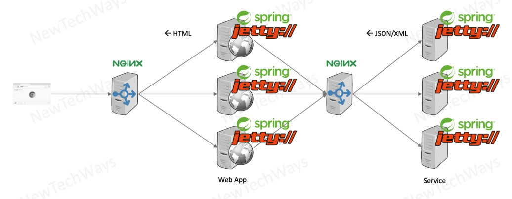
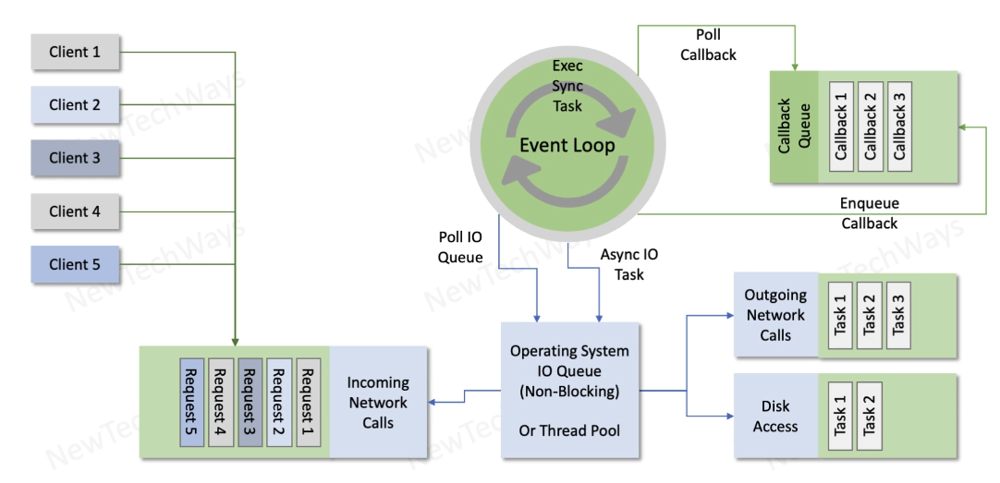

# Section 7: Technology Stack

- [Module contents overview](#module-contents-overview)
- [Reference system](#reference-system)
- [Web applications](#web-applications)
  - [Solutions for web applications](#solutions-for-web-applications)
  - [Apache web server](#apache-web-server)
    - [Apache webServer architecture](#apache-webserver-architecture)
    - [Apache webserver scalability](#apache-webserver-scalability)
  - [Nginx webserver](#nginx-webserver)
    - [Nginx architecture](#nginx-architecture)
    - [Nginx as reverse proxy and cache](#nginx-as-reverse-proxy-and-cache)
- [Web containers & spring framework](#web-containers--spring-framework)
  - [Jetty & Spring](#jetty--spring)
- [Node.JS](#nodejs)
  - [Node.JS event loop](#nodejs-event-loop)

---

## Module contents overview

- Platforms for
  - Web Apps
  - Services
  - Datastores
  - Analytics
- Platform Functionality
- Platform Architecture
  - Performance
  - Scalability
  - Reliability
- Platform Use-Cases
- Platform Alternatives
  - Comparison
- Architecting Solution
  - End-to-End

---

## Reference system

Layers of the system
- Web
- Services
- Database
- Analytics

represents a complete system

We are interested in the **functionality** of the platform that will be used

Also, we are interested in the **non-functional** aspects of the product
- Scale
- Resiliant
- Reliable
- Secure
- Perform

---

## Web applications

The frontend part of the application, we are concert how to
- build the server side of the system

The most important challenges are
- they receive the highest amount of load
- they are connected to clients which are located in long distances
- the communication must be secure

as we go down the system the load decreases progressively

We look at how efficiently it can serve the content and how much load it can handle.

---

## Solutions for web applications

- Static Content
  - Apache Web Server
  - Nginx Web Server
  - Cloud storage
- Dynamic Content
  - Web Server - Apache HTTPD, NodeJS
  - Java Web Containers - Tomcat, Jetty, Spring-Boot
- Content Caching
  - Nginx
- Content Distribution
  - CDN

---

## Apache web server

Apache Webserver can

- Store Static Content
  - HTML / CSS / JS files
  - Images files
  - Documents
- Generate Dynamic Content
  - Get data & generate pages dynamically
  - PHP, Python, Perl
  - No JSP / Servlets
- Act as a Reverse Proxy LB
  - Not great
  - Single point of contact with IP and will proxy all requests to backend web application

IO from disk can be slow, when fetching first time the file Apache will store the file in RAM 
- 64 GB RAM minimum depending on static content
- Heavily overloaded CPU and RAM for dynamic content

---

## Apache webServer architecture

- Based on Request-Response Model
- Clients connect using HTTP protocol
- Apache can provide persistent connections
  - each connection will occupy some memory
  - each connection will be allocated a thread from a thread pool
  - thread may access CPU, memory or network

When fetching dynamic pages the thread will 
- use a lot of CPU to process the page
- may use network to fetch data from database or service

A thread either using CPU or IO 

When processing a lot of pages Apache will run out of memory or CPU.

---

## Apache webserver scalability

Depends on how Apache it is used
- Apache as Webserver
  - For serving static / dynamic content
  - We can add more nodes when more CPU / memory is needed
- Apache as Reverse Proxy
  - Only sends requests to backend servers
  - The thread will be blocked until response is returned
    - which will send to client
  - Load enterily on memory for lots of connections
    - It will increase the thread pool size / 1 thread per client
  - We can only scale Apache as LB only vertically / **poor design**
 

Good option as a WebServer for dynamic webpages

---

## Nginx webserver

- Store Static Content
  - HTML / CSS / JS files
  - Image files
  - Documents
- Generate Dynamic Content
  - Not the best
- Act as a Reverse Proxy
  - Excellent
- Cache Content
  - Good

---

## Nginx architecture

- Event-Driven
- Uses Asynchronous IO
- Clients can connect to nginx using HTTP

The difference with Apache is that Apache allocates a thread for each connection
- Ngnix allocates a **Single thread** for all connections - no thread pool
  - this is the thread that processes requests
  - there will be threads for other activities
  - single thread doesn't leave CPU - can do a lot more processing
    - no thread context switching

**Single Thread**

- The thread will **issue an asynchronous IO Request**
- It will continue to execute - check if there is other request
- It will process IO response that comes back from OS

Because there is one Thread only memory for One thread is consumed
- 1M connections - One thread context

Nginx scales immensely as a reverse proxy / load balancer

Also suitable for static file data ➡️ asynchronous read

---

## Nginx as reverse proxy and cache

Apache is a perfect server to host a PHP based web application

**Nginx uses**

- In front of Apache we place Nginx to act as a cache
  - In case the file it's not in memory it will be a CacheMiss: Will be fetched from the Disk
  - In case of a CacheHit: file will be fetched from the memory
  - In that way nginx can act as a cache
    - Typically a very large memory is used for static data
- Acting as Reverse Proxy
  - Proxying request to backend web servers
  - can do load balancing of requests across multiple instances
- Can front services as a Reverse Proxy Load Balancer
  - e.g. RESTful service
- It can cache HTTP responses in services
  - can act as reverse proxy
  - and as a cache

If there is any requirement in the application to reverse proxy HTTP requests and we have to cache HTTP responses, we can use Nginx.

---

## Web containers & spring framework

- Dynamic content using Java
  - OO Language for complex logic
- Web Containers (provide Servlet Engine)
  - Tomcat
  - Jetty
- Application Servers
  - Provide: Servlet Engine, EJB Container, Session Clustering, Connection Pools, Caching, JMX, JMS, OSGI, ...
  - Wildfly / JBoss
  - Weblogic
  - Websphere
- Spring Boot
  - Runs embedded web container
    - Tomcat, Jetty

**MVC and Spring**

- MVC Architecture
  - Servlets for logic
  - JSP for presentation
- Spring Containers
  - Runs inside a Web container
  - Provides
    - IOC / DI
      - For business logic
    - Model View Controller
      - For frontends
    - JDBC Templates
      - For accessing DB
    - Connection Pools
      - Http, DB

---

## Jetty & Spring

**Jetty** can be used anywhere we have HTTP request

- web container
- can be used to host web applications
- can host services based on HTTP, e.g. REST
- HTML response

On top of Jetty we can use **Spring framework**, for Java

- Response in JSON / XML

nginx web proxy alleviates RESTful services from some of the load by caching the responses

---

## Node.JS

JavaScript on the server side

- HTTP server
  - Uses JavaScript engine to process requests
- Highly efficient at handling a large-number of connections
  - For requests that are IO bound and not CPU bound
- Single threaded to handle all connections
  - Saves memory
  - Avoids context switching

No transformation required end to end from browser to database
- messages can be communicated in JSON

---

## Node.JS event loop

Node.JS internally executes JavaScript engine and JavaScript engine has an **event loop**
- Single thread which continuously executes
- Processing all requests
- Executes synchronous functions
  - This blocks the event loop
- Gives asynchronous functions to OS
- Is polling OS IO to get incoming client requests
- Is polling for any response to outgoing network calls

Any asynchronous call will be put into the callback queue

Node.js polls these callbacks and when it's done it will poll for any incoming requests

Operating System may be
- listening to client request for incoming calls
- Execute outgoing calls made from Node.JS asynchronously

External calls are made in asynchronous way, that's the purpose of Node.JS

**Very efficient**

- allows you to serve requests for huge number of clients
  - can maintain lots of connections
- has very small memory footprint
  - One thread minimizes context switching

---

