# Section 7: Technology Stack

- [Module contents overview](#module-contents-overview)
- [Reference system](#reference-system)
- [Web applications](#web-applications)
  - [Solutions for web applications](#solutions-for-web-applications)
  - [Apache web server](#apache-web-server)
    - [Apache webServer architecture](#apache-webserver-architecture)
    - [Apache webserver scalability](#apache-webserver-scalability)
  - [Nginx webserver](#nginx-webserver)
    - [Nginx architecture](#nginx-architecture)
    - [Nginx as reverse proxy and cache](#nginx-as-reverse-proxy-and-cache)
  - [Web containers & spring framework](#web-containers--spring-framework)
    - [Jetty & Spring](#jetty--spring)
  - [Node.JS](#nodejs)
    - [Node.JS event loop](#nodejs-event-loop)
  - [Cloud Solutions for web](#cloud-solutions-for-web)
    - [Cloud Storage](#cloud-storage)
    - [Cloud CDN](#cloud-cdn)
- [Services](#services)
  - [Services solutions](#services-solutions)
    - [Memcached](#memcached)
    - [Memcached Architecture](#memcached-architecture)
    - [Redis Cache & its architecture](#redis-cache--its-architecture)
  - [Cloud Caching Solutions](#cloud-caching-solutions)
  - [RabbitMQ](#rabbitmq)
    - [RabbitMQ architecture](#rabbitmq-architecture)
  - [Kafka architecture](#kafka-architecture)
  - [Redis Pub/Sub](#redis-pubsub)
  - [Cloud MQ solutions](#cloud-mq-solutions)
- [Datastores](#datastores)
  - [Datastores solutions](#datastores-solutions)
  - [RDBMS](#rdbms)
    - [RDBMS scalability architecture](#rdbms-scalability-architecture)
  - [NoSQL objectives & trade-offs](#nosql-objectives--trade-offs)
    - [Amazon DynamoDB](#amazon-dynamodb)
      - [DynamoDB architecture](#dynamodb-architecture)
    - [Google BigTable](#google-bigtable)
      - [BigTable architecture](#bigtable-architecture)
    - [HBase](#hbase)
    - [Cassandra](#cassandra)
      - [Cassandra features](#cassandra-features)
    - [MongoDB](#mongodb)
      - [MongoDB architecture](#mongodb-architecture)
- [Analytics](#analytics)
  - [Analytics solutions](#analytics-solutions)
  - [Logstash architecture](#logstash-architecture)
    - [Logstash data streaming architecture](#logstash-data-streaming-architecture)
  - [Fluentd](#fluentd)
  - [Elasticsearch](#elasticsearch)
    - [Elasticsearch architecture](#elasticsearch-architecture)
  - [Hadoop HDFS](#hadoop-hdfs)
    - [Map Reduce](#map-reduce)
  - [Apache Spark](#apache-spark)
  - [Stream processing](#stream-processing)
- [Summary](#summary)

---

## Module contents overview

- Platforms for
  - Web Apps
  - Services
  - Datastores
  - Analytics
- Platform Functionality
- Platform Architecture
  - Performance
  - Scalability
  - Reliability
- Platform Use-Cases
- Platform Alternatives
  - Comparison
- Architecting Solution
  - End-to-End

---

## Reference system

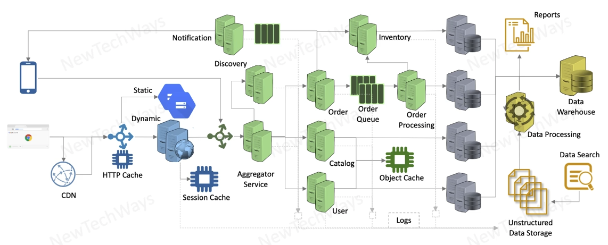

Layers of the system
- Web
- Services
- Database
- Analytics

represents a complete system

We are interested in the **functionality** of the platform that will be used

Also, we are interested in the **non-functional** aspects of the product
- Scale
- Resiliant
- Reliable
- Secure
- Perform

---

## Web applications

The frontend part of the application, we are concert how to
- build the server side of the system

The most important challenges are
- they receive the highest amount of load
- they are connected to clients which are located in long distances
- the communication must be secure

as we go down the system the load decreases progressively

We look at how efficiently it can serve the content and how much load it can handle.

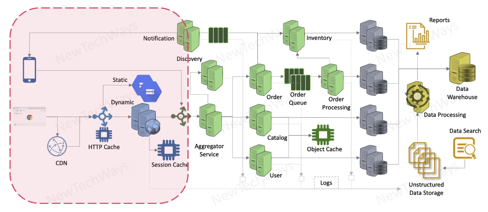

---

## Solutions for web applications

- Static Content
  - Apache Web Server
  - Nginx Web Server
  - Cloud storage
- Dynamic Content
  - Web Server - Apache HTTPD, NodeJS
  - Java Web Containers - Tomcat, Jetty, Spring-Boot
- Content Caching
  - Nginx
- Content Distribution
  - CDN

---

## Apache web server

Apache Webserver can

- Store Static Content
  - HTML / CSS / JS files
  - Images files
  - Documents
- Generate Dynamic Content
  - Get data & generate pages dynamically
  - PHP, Python, Perl
  - No JSP / Servlets
- Act as a Reverse Proxy LB
  - Not great
  - Single point of contact with IP and will proxy all requests to backend web application

IO from disk can be slow, when fetching first time the file Apache will store the file in RAM 
- 64 GB RAM minimum depending on static content
- Heavily overloaded CPU and RAM for dynamic content

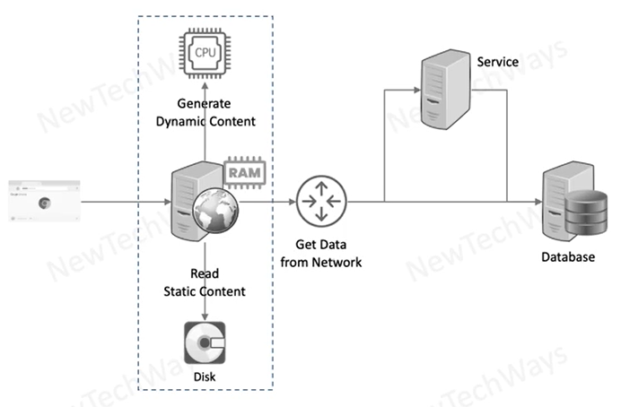

---

## Apache webServer architecture

- Based on Request-Response Model
- Clients connect using HTTP protocol
- Apache can provide persistent connections
  - each connection will occupy some memory
  - each connection will be allocated a thread from a thread pool
  - thread may access CPU, memory or network

When fetching dynamic pages the thread will 
- use a lot of CPU to process the page
- may use network to fetch data from database or service

A thread either using CPU or IO 

When processing a lot of pages Apache will run out of memory or CPU.

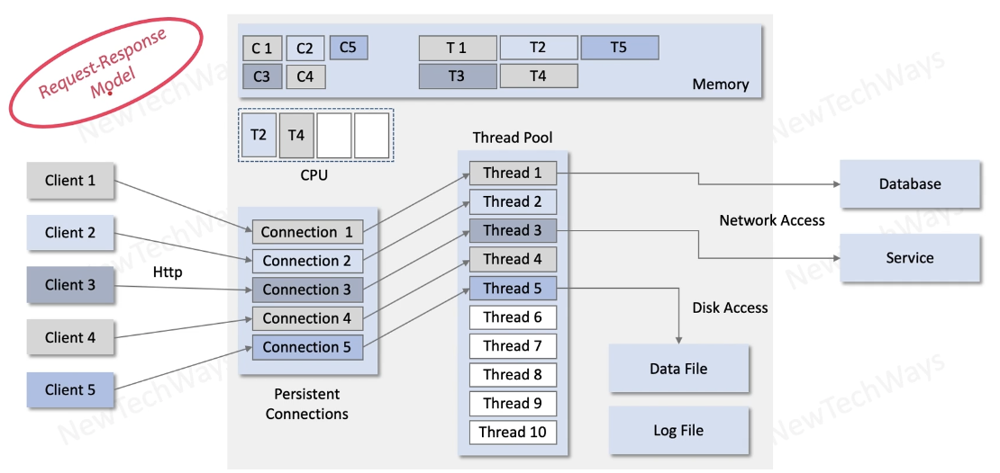

---

## Apache webserver scalability

Depends on how Apache it is used
- Apache as Webserver
  - For serving static / dynamic content
  - We can add more nodes when more CPU / memory is needed
- Apache as Reverse Proxy
  - Only sends requests to backend servers
  - The thread will be blocked until response is returned
    - which will send to client
  - Load enterily on memory for lots of connections
    - It will increase the thread pool size / 1 thread per client
  - We can only scale Apache as LB only vertically / **poor design**
 

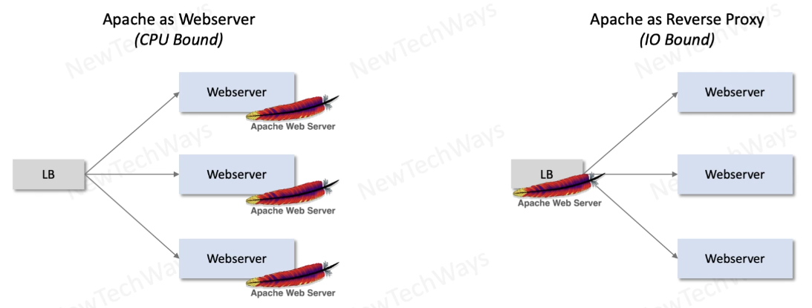

Good option as a WebServer for dynamic webpages

---

## Nginx webserver

- Store Static Content
  - HTML / CSS / JS files
  - Image files
  - Documents
- Generate Dynamic Content
  - Not the best
- Act as a Reverse Proxy
  - Excellent
- Cache Content
  - Good

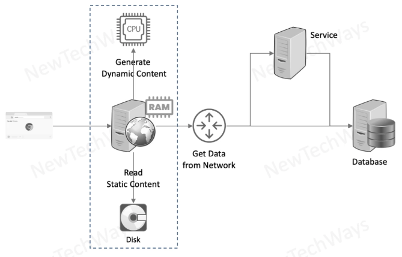

---

## Nginx architecture

- Event-Driven
- Uses Asynchronous IO
- Clients can connect to nginx using HTTP

The difference with Apache is that Apache allocates a thread for each connection
- Ngnix allocates a **Single thread** for all connections - no thread pool
  - this is the thread that processes requests
  - there will be threads for other activities
  - single thread doesn't leave CPU - can do a lot more processing
    - no thread context switching

**Single Thread**

- The thread will **issue an asynchronous IO Request**
- It will continue to execute - check if there is other request
- It will process IO response that comes back from OS

Because there is one Thread only memory for One thread is consumed
- 1M connections - One thread context

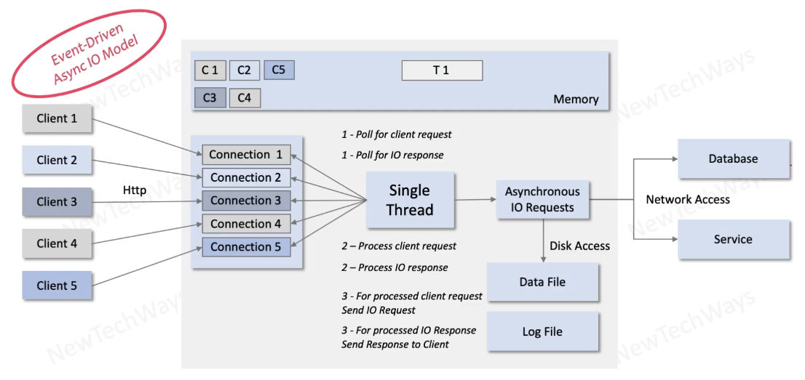

Nginx scales immensely as a reverse proxy / load balancer

Also suitable for static file data ➡️ asynchronous read

---

## Nginx as reverse proxy and cache

Apache is a perfect server to host a PHP based web application

**Nginx uses**

- In front of Apache we place Nginx to act as a cache
  - In case the file it's not in memory it will be a CacheMiss: Will be fetched from the Disk
  - In case of a CacheHit: file will be fetched from the memory
  - In that way nginx can act as a cache
    - Typically a very large memory is used for static data
- Acting as Reverse Proxy
  - Proxying request to backend web servers
  - can do load balancing of requests across multiple instances
- Can front services as a Reverse Proxy Load Balancer
  - e.g. RESTful service
- It can cache HTTP responses in services
  - can act as reverse proxy
  - and as a cache

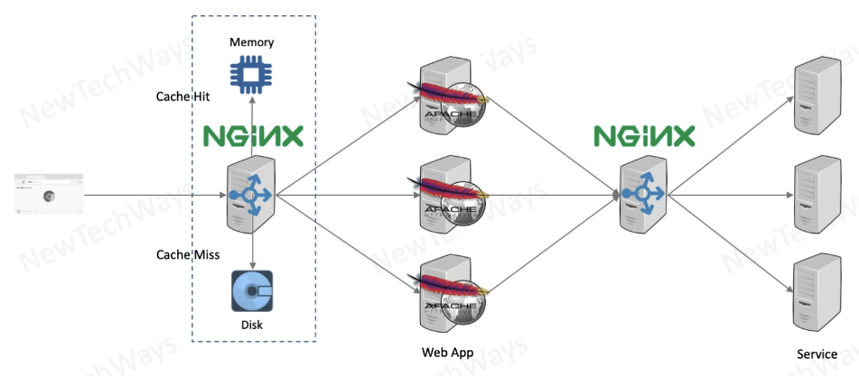

If there is any requirement in the application to reverse proxy HTTP requests and we have to cache HTTP responses, we can use Nginx.

---

## Web containers & spring framework

- Dynamic content using Java
  - OO Language for complex logic
- Web Containers (provide Servlet Engine)
  - Tomcat
  - Jetty
- Application Servers
  - Provide: Servlet Engine, EJB Container, Session Clustering, Connection Pools, Caching, JMX, JMS, OSGI, ...
  - Wildfly / JBoss
  - Weblogic
  - Websphere
- Spring Boot
  - Runs embedded web container
    - Tomcat, Jetty

**MVC and Spring**

- MVC Architecture
  - Servlets for logic
  - JSP for presentation
- Spring Containers
  - Runs inside a Web container
  - Provides
    - IOC / DI
      - For business logic
    - Model View Controller
      - For frontends
    - JDBC Templates
      - For accessing DB
    - Connection Pools
      - Http, DB

---

## Jetty & Spring

**Jetty** can be used anywhere we have HTTP request

- web container
- can be used to host web applications
- can host services based on HTTP, e.g. REST
- HTML response

On top of Jetty we can use **Spring framework**, for Java

- Response in JSON / XML

nginx web proxy alleviates RESTful services from some of the load by caching the responses

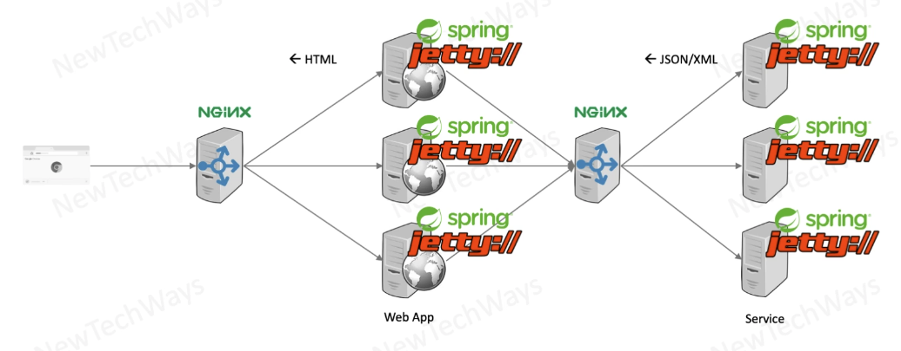

---

## Node.JS

JavaScript on the server side

- HTTP server
  - Uses JavaScript engine to process requests
- Highly efficient at handling a large-number of connections
  - For requests that are IO bound and not CPU bound
- Single threaded to handle all connections
  - Saves memory
  - Avoids context switching

No transformation required end to end from browser to database
- messages can be communicated in JSON

---

## Node.JS event loop

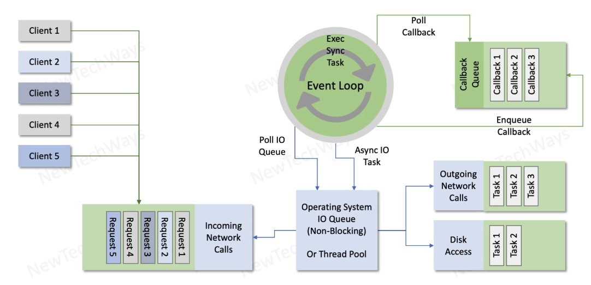

Node.JS internally executes JavaScript engine and JavaScript engine has an **event loop**
- Single thread which continuously executes
- Processing all requests
- Executes synchronous functions
  - This blocks the event loop
- Gives asynchronous functions to OS
- Is polling OS IO to get incoming client requests
- Is polling for any response to outgoing network calls

Any asynchronous call will be put into the callback queue

Node.js polls these callbacks and when it's done it will poll for any incoming requests

Operating System may be
- listening to client request for incoming calls
- Execute outgoing calls made from Node.JS asynchronously

External calls are made in asynchronous way, that's the purpose of Node.JS

**Very efficient**

- allows you to serve requests for huge number of clients
  - can maintain lots of connections
- has very small memory footprint
  - One thread minimizes context switching

---

## Cloud Solutions for web

 **Benefits of Managed Services in the Cloud**
 
- Hardened solutions
- Automated deployment
- Built-in scalability & reliability
- Global deployment solutions

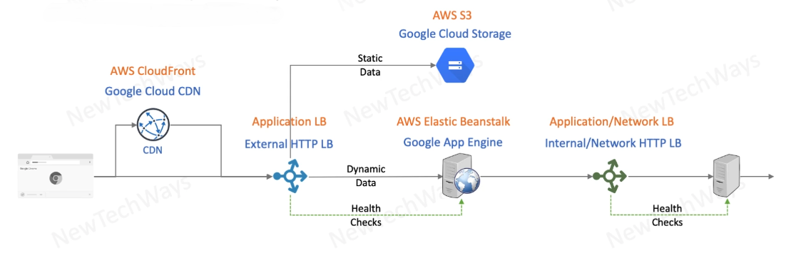

---

## Cloud Storage

- Unlimited Disk Space
- Version Control
- Access Control
- Low Latency
  - No overhead of Directory structure
- High Throughput
  - Parallel clients (storage **replicates** files in multiple locations)
  - Large files can be broken into smaller chunks for parallel read
- High Availability & Reliability
  - Multiple copies
  - Multiple physical locations
- Static Website Creation

---

## Cloud CDN

The amount of static data in a web application is much larger compared to dynamic data. 

If we add the distance between the origin server and the user location, the problem becomes bigger.

**Solution: Cloud CDN**

- Low latency local access for cache hits
- Persistent connections for cache miss
- Lower load on the backend

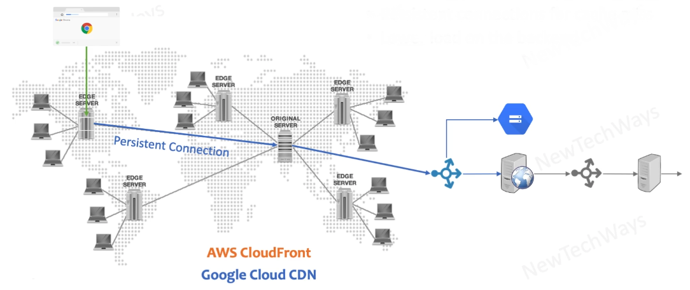

---

## Services

Biggest challenge while building services: Run business logic which can be complex
- Web Services
- RESTful services

Related topics
- Caching
- Asynchronous processing: Queues
- How to host business logic: Containers
- Load Balancing: Reverse proxy

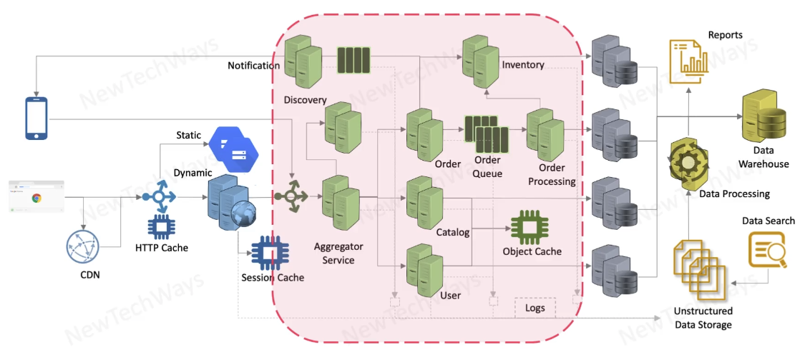

---

## Services solutions

- Web Containers
  - REST & Spring Containers
- Object Caching
  - Memcache
  - Redis
- Asynchronous Messaging
  - Redis
  - RabbitMQ
  - Kafka
- Service Mesh
  -Netflix
  - Istio

---

## Memcached

Popular solution for caching objects, it can be in:

- web application layer
  - for caching session objects
- service layer
  - cache objects created after computation / after fetching from DB
- service memory itself
  - Issues
    - Less cache hits (request can hit another node)
    - Key-Data duplication (storing data for the same key in multiple nodes)

**Data**

- frequently accessed
- NOT modified very frequently

**Properties**

Memcached is a centralized cache so every node will connect to it

- Stores key value pairs
- Values can be
  - Any blob
  - Any size
    - Preferred < 1 MB
    - Max is configurable
- TTL can be set differently for each data
- Eviction expunges expired data followed by LRU (least recently used) data

---

## Memcached Architecture

Memcached can be installed as a cluster of nodes, client knows all the IPs of the nodes. 

Client will use a client library which makes a DNS call to get the IP address of any node.

- Cache-aside pattern
  - e.g. memcache is looking for key 3
  - will go to DB and get the value of the key 3
  - will put that key into mecache cluster, in one of the nodes
  - next time it will be available in the node
  - client knows to go node 3 using hash function and percentile with 2
  - client itself is managing the state of all the nodes
- Sub-millisecond Latency
- Horizontally Scalable
  - Data is partitioned
- High throughput
  - Parallel operations
- Cluster aware client library
  - Consistent hashing for resolving a node
- Node failure is treated as a cache miss
  - Use large number of nodes with less data
- Data is lost if a node crashes or restarted

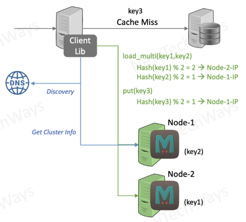

---

## Redis Cache & its architecture

For Object-caching, came after memcached and filled gaps, memcached + new features

- Much like Memcached
- It is a [**Key -> Data structure**] store, instead of key value
  - Strings, Lists, SortedSets, Maps, ...
  - memached has latency because it retrieves the entire list for e.g. adding a element
- Data-Store mode for Persistence
  - Stores data on a disk
  - Allows backups
  - Can be started pre-populated with a backup
- Data Replication
  - Asynchronous and synchronous
  - Read load distribution
  - High Availability
- Can also be used as a messaging queue
- **Data-Store mode requires fixed number of nodes**
  - Cache mode is suitable for node scaling

In order to support more read load, we can add slave instances to masters

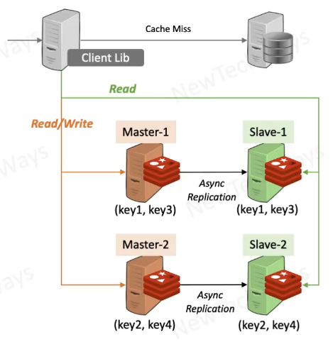

---

## Cloud Caching Solutions

On-premises solutions can be deployed to the cloud also as IaaS or fully managed by cloud

- AWS Elastic Cache
  - Memcached
  - Redis
- Google Memorystore
  - Memcached
  - Redis

**Benefits**

- Fully Managed
- Sub-millisecond latency
- Scalable to 5 TB
- Highly available (99.9%)

---

## RabbitMQ

General purpose messaging queue - most widely used

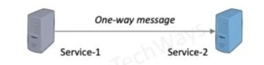

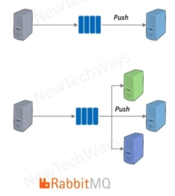

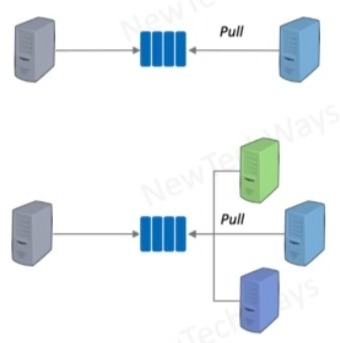

**Push**

- We want to pass a message from Service-1 to Service-2: **One to One**
  - Service-1 is not looking for a response: **One-way message**
  - In between services we can put a message queue
  - Service-1 is putting it into the queue (instead of sending directly to Service-2)
- We can deliver the message to multiple services: **One to Many**

**Pull**

The subscriber takes the responsibility of pulling the message
- One to One
- One to Many

Why not pass the message directly to the service and use a message queue to do this asynchronously? Because of Delivery Goals

- Design Goals
  - At-Least-Once Delivery
  - Message Sequencing - FIFO
  - Interface Decoupling
    - Service-2 doesn't need to know the technology used by Service-1
  - Consumer Decoupling
     - Service-1 doesn't know to which service it is delivering the message
     - If the communication is synchronous, Service-1 needs to know the host and port of Service-2
     - Only needs to know the host and port of the messaging queue
     - Makes more sense in the One to Many delivery 
  - Message Rate Decoupling
    - e.g. producer of the message: Service-1 is producing messages in a very high rate
    - the queue can absorb all those messages
    - the message queue can deliver the messages in a rate the services can process
    - Makes more sense in One to One communication
      - the message processing (e.g. from Service-2 that writes data to DB) cannot happen at the same rate as the rate the messages are received by Service-1
      - the rate of message receiving and the rate at which messages are processed are totally different
      - If we don't have a message queue, the Service-2 will go down - cannot bare the load
- Consumer Mode
  - Push
  - Pull
- Use Cases
  - Service Integration
    - Asynchronous messages can be passed between services - asynchronous integration
  - Message Buffer
    - messages reveived in a high rate - in between Message Queue can act as a buffer
    - message queue can store messages temporarily
    - if the load decreases in Service-1, Service-2 eventually will be able to cope up with the load
    - we can add more consumers to decrease the load

**RabbitMQ vs Kafka**

Rabbit MQ can be used as a general purpose messaging queue for all use cases (pull, push)

Kafka can be used only for poll based messaging where consumers have to pull the message

Kafka also shines in streaming workflows
- incoming message flow rate is extremely high
- queue is always full

In streaming workflows we need a queue to act as a message buffer
- RabbitMQ cannot scale very high in case of streaming scenario

---

## RabbitMQ architecture

- General purpose message broker
- Messages are pushed to consumers
- Message deleted once acknowledged
- Message ordering is guaranteed (compared to Kafka which is not)
- Useful for asynchronous service integration
- Both persistent and transient messages are supported
  - Transient: Rabbit MQ delivers it immediatetly to it's consumer - doesn't store to disk
    - for very high speed message delivery
  - Persistent: When we need to guarantee that the message is definetely delivered
    - it becomes possible because messages are stored to the disk
- Uses built-in component called exchange for routing
  - there can be multiple queues inside the MQ
  - exchange controls to which queue / topic messages go by applying routing rules

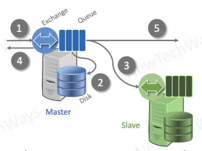

> In persistent mode message will be stored in the hard disk (2)

> If we setup replication (must in production), we create a replica (master-slave) (3) and that MQ will store also the message

> Once the message is stored to the disk and it is replicated, the message will be acknowledged to it's producer (4)

> The queue takes the message from it's memory and tries to deliver to it's consumer (if available) (5)

> Consumer processes the message and gives an acknowledgement back to the queue

> The queue will delete the message from it's memory and disk

> Also the slave will also delete the message

Replication adds to the reliability / availability of messaging queue

All the load comes to master messaging queue
- client can connect to master or slave (but slave will not process any message, load handled my the master only)

Also
- Scales to 50K messages per second
- Scales well vertically
- Not horizontally scalable
  - Master-Slave replication for high availability
    - Clients can connect to any node
    - All publish, consume operations first go to master

---

## Kafka architecture

Useful when producers producing messaging at a very high rate

We can think of Kafka as a distributed log file

- Performance
  - Million messages per second
  - Sequential writes and reads on log files
  - Relies on page cache for quick reads
- Horizontally Scalable
  - Topics are partitioned
    - we can do more parallel operations
- Order of data guaranteed only within a partition
  - Global order in queue is lost (trade-off)
  - Producer can decide the partition
- Messages are not deleted, so can be replayed
- Consumers can only pull the data (trade-off)
  - No push by Kafka
  - Not designed for service integration
- Useful for streaming analytical workloads
  - Where high throughput is required
  - Click streams, Page views, Logging, Ingestion, Security

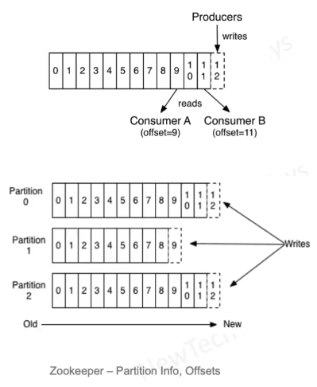

The write overhead in RabbitMQ is significant because it internally uses a b-tree structure to store data

The producer write operation in Kafka is extremely fast
- producer keeps track of the indeces used
- log files can live on Kafka forever
- the OS will read the log file in chucks and those will be stored in OS memory (page cache)
  - OS page cache responsibility
  - that's why it reads very fast

Consumers can also scale horizontally, they can be distributed in different partitions

---

## Redis Pub/Sub

Redis is an excellent choice for in-memory data store

Redis has another functionality called Pub/Sub
- excellent messaging queue for specific use cases

**Use cases**
- fast messaging which does not require persistence

**Features**

- For short lived messages with no persistence
  - Much like a synchronous call
  - Fire and forget
    - No delivery guarantee
- Million operations per second
- Useful for making dashboards
  - Leaderboard
- Comparison
  - Kafka
    - No push
    - Writes to log
  - RabbitMQ Transient
    - Delivery acknowledgement
    - Deletion of delivered messages

> Channels === Topics

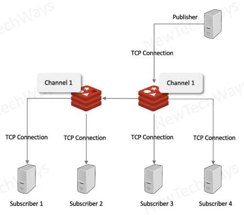

Redis cluster here has two nodes

Publisher publishes messages to it's channel, and they are immediately delivered to it's subcribers

Node 2 can subscribe to node 1

TCP connection will only be disconned if it's closed by the client or the server

---

## Cloud MQ solutions

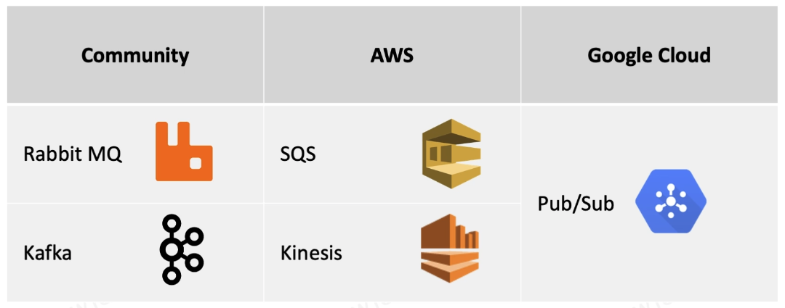

- Community
  - Rabbit MQ
    - used for application integration (can push messages)
  - Kafka
    - Not a general purpose MQ - used when there is very high throughput
    - Big Data, Streaming, IoT
    - Not for application integration unless there is exceptional high load
    - consumers can only pull messages
- AWS
  - SQS
    - General purpose messaging queue like Rabbit MQ
    - Can replace on-premise Rabbit MQ with SQS
  - Kinesis
    - Used in IoT, Big Data e.g. high throughput of data
    - can replace Kafka with this managed service solution
- Google Cloud
  - Pub / Sub
    - Can be used for both scenarios
    - General messaging and for very high throughput messaging
    - Horizontally scalable - managed service

With RabbitMQ or Kafka you have to manage their clusters on your own

Redis is a special case, not a general purpose messaging queue

---

## Datastores

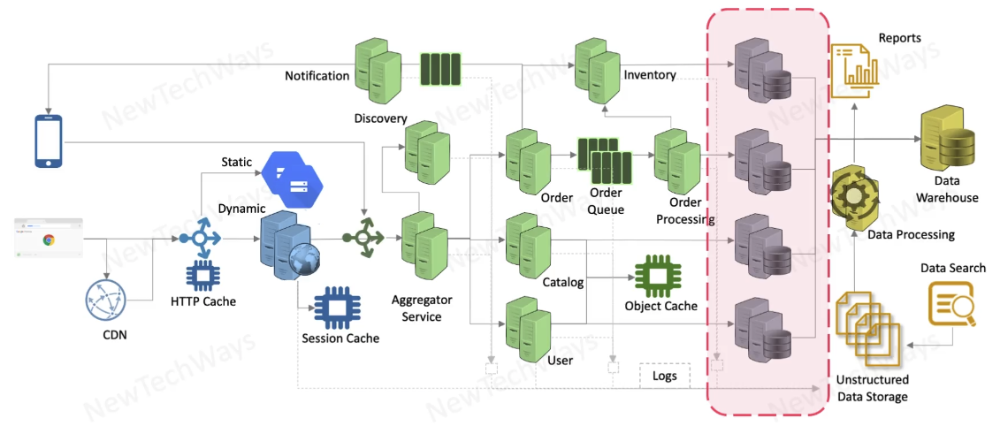

Datastores or Databases

We not only read data but we also modify data
- Storage is done on disc
- Can have high latency
- Load on Databases is not as high as frontend layer or service layer

---

## Datastores solutions

- RDBMS
  - Oracle
  - SQL Server
- Distributed Databases
  - Key-Value
    - Dynamo
  - Column Family
    - Big Table
    - Cassandra
    - HBase
  - Document Oriented
    - MongoDB

---

## RDBMS

- General purpose database (< 1 - 5TB data, 10K connections)
- ACID Transactions
  - Update of multiple records or tables
  - _Possible only on a single node or else it requires 2PC/3PC_
- Data Consistency
  - Data same for all readers at any given time
  - _Leads to low availability_
- Fixed Schema
  - Data analysics - _Impedes application evolution_
    - Columns can be selected
    - Rows can be filtered
    - Queries can Join Tables
    - _Joins may slow down the system_
  - Query pattern can change or evolve
    - Any column can be indexed
    - Indeces can be created whenever required
  - Normalized Data
    - Efficient storage and writes
  - Overwrite for updates
    - _Allows only one version of data_
    - _Old design for expensive disk space_

NoSQL came out of the limitations of RDBMS scalability

---

## RDBMS scalability architecture

Although RDBMS are vertically scalable, still we can do few enhancements to scale RDBMS and make it more reliable

**Methods**

- Vertical Partitioning for Scalability
  - one RDBMS for each service
  - deployed on separate nodes
  - code should work in an isolated way (cannot do transactions between services)
    - 2 Phase Commit
    - Eventual Consistency
- Replication for Reliability / Availability
- Can use read replicas for sharing load
  - Drawback: read queries not consistent with master db (time for replication)
  - Reads are scalable, Writes still not scalable

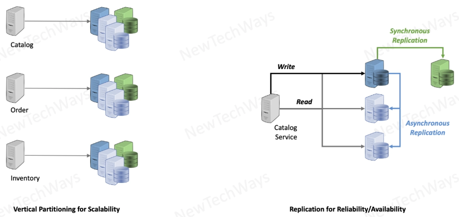

In Oracle even with Real Application Cluster still the same DB is used and share the same disk

Cost of scalability is getting higher with RDBMS

---

## NoSQL objectives & trade-offs

NoSQL are overcoming the limitations of RDBMS - particularly the scalability

| Objective | Architectural Choice | Trade-Off |
| --------- | -------------------- | --------- |
| **Scalability** | Horizontal Partitioning, Commodity Hardware | ACID Transactions,   Joins |
| Availability | Data Replication, Eventual Consistency | Data Consistency |
| Flexible Schema | Key-Value, Column Family, Document-Oriented | SQL, Secondary Indexes,  Integrity Constraints|
| Performance | Aggregate Schema, In-Memory R/W | Normalization, Non-Key Queries |

---

## Amazon DynamoDB

- Key-Value Pair Datastore
- Used for High Scalability & Availability
- Table is a Hash-Map
  - Persistent
  - Distributed
- API
  - Put, Get, Update, Delete, Query
- Index Key - has two parts
  - Partition Key
    - Can have only one attribute
    - Key is hashed to determine the partition
  - Sort Key
    - Determines sort order of an item within a partition
    - Can be used for range query <. >, like
- R / W ops for a key are atomic

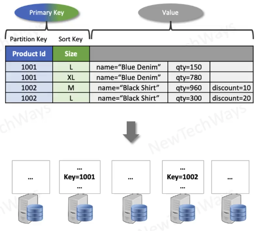

---

## DynamoDB architecture

- Suitable for storing **small chunks of data**
  - Key values less than 1MB
- Peer-To-Peer cluster
  - No master - write on any node
  - Each node responsible for a set of keys
    - through consistent hashing of virtual nodes for key allocation
- Highly Scalable
  - Practically any number of nodes
  - Petabytes of data
  - Can handle 10 million RW ops requests / second
- Highly Available
  - Updates are not rejected even in case of network partitions or server failures
    - not possible in master-slave architecture
  - Vector clocks and business rules to resolve merge conflicts
    - because we can write to any node, 2 users may write at the same time
    - it will be resolved via timestamps or vector clocks or business rules
- Consistency guarantee is adjustable
  - (nodes to read) R + (nodes to write) W > (total number of nodes) N for strong consistency
  - Favors high availability over consistency
  - users can have different values
  
---

### Ring cluster

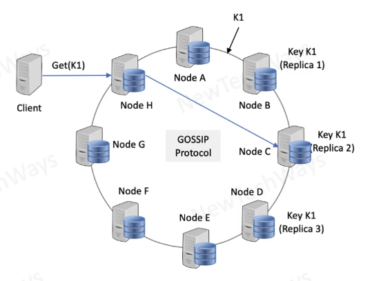

- Ring represents range of values for a partition key column
- Machine IP/Name is hashed to occupy a position on the ring

Nodes B,C,D: responsible for key 1
- client can connect to any node to the cluster to
  - get this key
  - update this key
- the node will forward the request

GOSSIP protocol: each node randomly connects to other nodes in the cluster
- will propagate the state of the cluster

---

## Google BigTable

**NoSQL DB**

- Basis for Apatche HBase (open source implementation)
- Column-Family Storage
  - save storage, makes searches faster
  - data grouped into column families
    - document
    - language
    - referrer (3 columns)
      - list sites that have backlink to original site
      - Column value: The Link Text
  - no sort key like amazon db
- Table as Tree-Map (instead of hash map in amazon db)
  - Sparse
  - **Sorted** (this means tree-map)
  - Persistent
  - Distributed
- Limited CF (<100)
- CFs are compressed
- Unlimited columns
- R/W ops atomic for a key
- Timestamps for versioning

This is the logical representation of the data. 

The way is stored is different, **it uses the Index / Primary (Composite) Key**

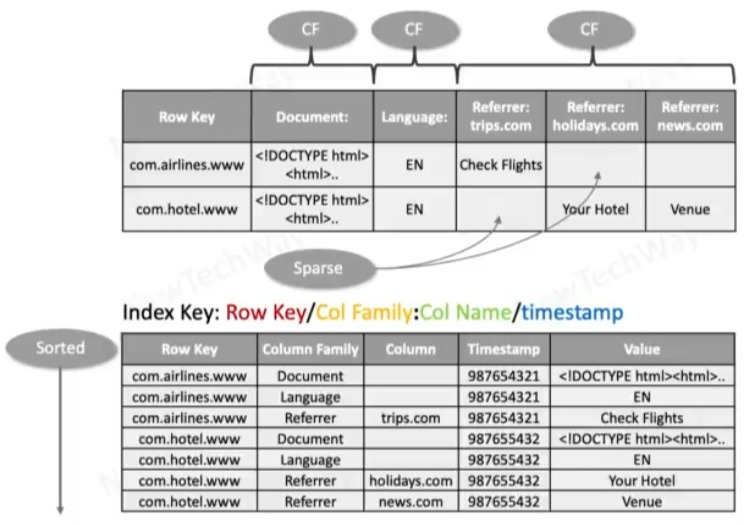

Now the data is not sparsely stored.

---

## BigTable architecture

Can be used for very high throughput and low latency, e.g. stream data

**Properties**

- Schema-less, structured (CF), sorted data (for range queries, extremely efficient)
  - Index for every column
- GFS (Google File System) for reliable persistent storage
  - Replicated storage for large files
- In-memory tablet servers
  - High R/W throughput with low latency
  - Single copy of data for read and write
    - No write conflicts
- Horizontally scalable
  - Stores peta / exabytes of data
  - Client load is distributed
- Strongly consistent

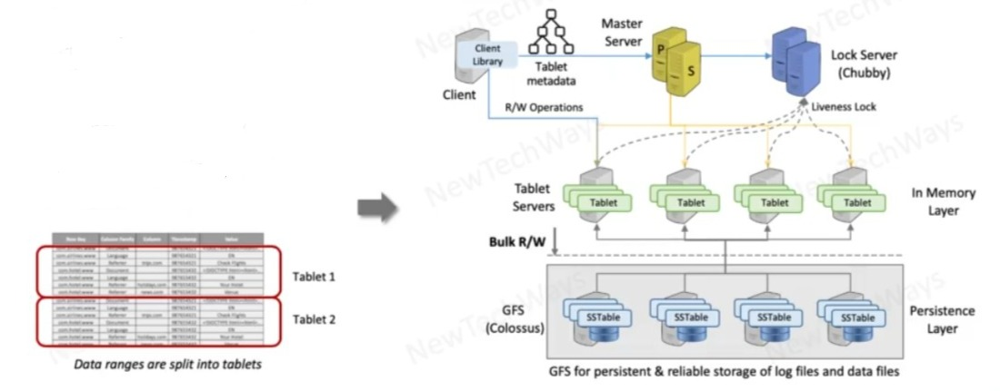

**Tablet servers**

- Intermediate layer between GFS and BigTable
- mostly acts like a cache
- read / write operations become very fast
  - write always happens in memory
  - if node goes down, data still will be written becomes of log file
  - writes are reliable

**Client**
- Caches tablet metadata
- directory works with tablet servers
- never connects to master or lock server
- only interacts with master / lock server to get tablet metadata
  - b-tree clients stores in each memory

**Master**
- Checks if tablet servers are live
- Assigns tablets to node servers

---

## HBase

APIs are slightly different than BigTable
- Memory: Region Server vs Tablet
- Persistence: Hadoop HDFS vs GFS

**HBase Properties**

- Open source implementation of BigTable
- Column Family schema
- Keys are Range Partitioned
- Storage on Hadoop HDFS
- Strong consistency over high availibility
  - a cluster if it doesn't have quorum (min num), entire goes down
    - vs in Mongo DB even 1 instance can serve
    - impacts high availability when no available nodes
- Highly scalable
- High throughput and low latency writes

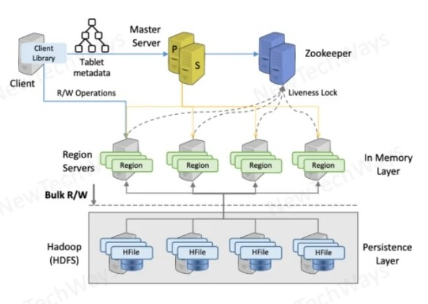

---

## Cassandra

Becomes like an RDB table

- Open source Database
- Came out after DynamoDB and BigTable
  - has features from both of them

**Features**

**Data Model: Column-Family Storage**

Can store structured data and million of columns with column family architecture

- similarities to DynamoDb and BigTable
- a table is called a column family
- has a partition key and a sort key, like DynamoDB
  - primary key = partition key + sort key
    - partition key: decides the row
    - sort key: decides the order for that partition key
- can have any number of columns, because they are really rows
- you can store structured data like BigTable and gets exploded into multiple rows
- **the difference is that each product id goes to a different partition**, like DynamoDB

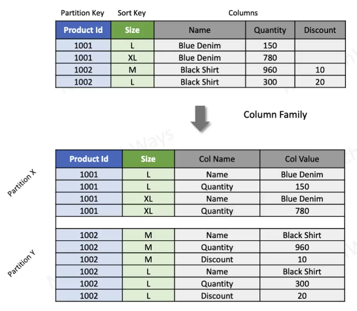

**Like BigTable and DynamoDB**
- Cassandra is also clustered
- horizontaly scalable DB
- data can be partitioned into different nodes

**Clustering functionality is borrowed from DynamoDB**
- Peer-to-Peer topology, no master
- each node responsible for a set of nodes etc..
- Cassandra DB has di-centralized architecture
  - high availability even in the precence of network partitions
  - can have conflicting writes on replica nodes of the same key

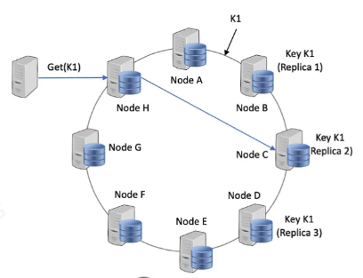

----

### Write Operations in Cassandra

Borrowed from BigTable

1. Write Operation comes to Cassandra
2. Write Operation is logged on a write ahead log file - quickly sequencial IO
3. Write is actually done in Memtable (same as tablet in BigTable) - no disk write - extremely fast
4. Write operation is acknowledged to each client that is done
5. Memtables are flashed into SSTables - to disk - when there is shortage of memory (like BigTable)

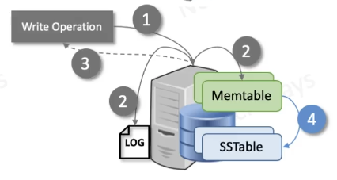

After a failure, when a node comes back, can recreate the Memtable by
- reading data from the SSTable
- applying the operations from the log 

If the node cannot be restarted, we have replica nodes (the node which is responsible for a particular key)

Read also works like BigTable, state come out of the memory if they are in the memory otherwise from SSTable.
- Cassandra like BigTable can be used for very high throughput

---

## Cassandra features

- Schema-less, Column-Family Structured Data
  - Sparse
  - Persistent
  - Distributed by hash partitioning
- Horizontally Scalable
  - **Petabytes of data**
- Highly Available (at the cost of consistency)
  - Even during network partitions
  - spread of ring can be huge: over continents
- **High throughput** R/**W** operations
- Merge conflicts
  - Vector clocks
  - Timestamps
  - Business rules

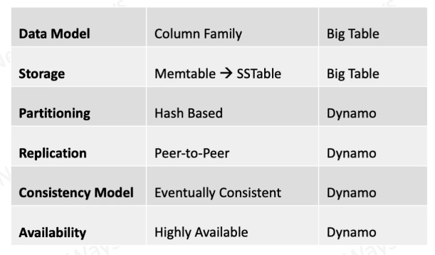

---

## MongoDB

Another No-SQL DB, horizontally scalable, eventually consistent etc.

**Schema is special in MongoDB** (structured data, key-value already used in others)

- Key ➡️ Document
  - In Binary JSON (bson) format
  - **Allows nesting** designed for that
  - can choose keys to update
  - structure known to MongoDB
- Columns created dynamically
- Columns can be indexed
  - search becomes faster
- Documents can be queried
  - on id and or column values
- An operation on a single document is atomic
  - 2 PC for multiple documents

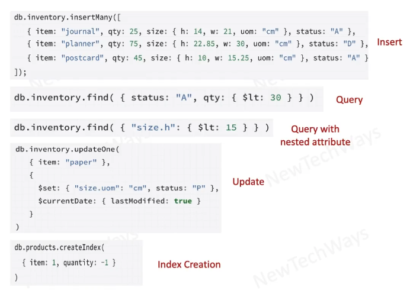

---

## MongoDB architecture

- Indexing for faster search
  - It's write overhead
- Sharding for Scalability
  - Range sharding
    - useful for range queries: id > 10 & < 200
  - Hash sharding
    - even distribution: id == 201, faster
- Replication
  - Master Slave
    - No write conflicts
    - For write only goes to Primary
      - Asynchronly replicated in secondary
      - eventually consistency
        - can get strong consistency but latency goes high
  - Asynchronous (default)
  - Synchronous (on demand)
  - Primary has additional set of secondary keys
  - Load Distribution
- Works very well with Node.js
  - Javascript -> Node.js -> Mongo
    - JSON format

**Use Cases**
- When we do not want transformation of objects
- high scalability

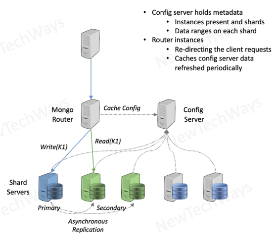

---

## Analytics

**Special properties**

- does not participate in transactions
- no users are activily connected
- offline
- bulk / batch processing
- stream processing
  - If we decide to process the data as they arrive

Whetever data we have accumulated, analytics layer is to analyze that data

- historical data
  - bulk / batch processing
- current data
  - real time processing

**Challenges**

- Structured + Unstructured Data Storage
- huge amount
- more real time data (IoT, social) is getting generated

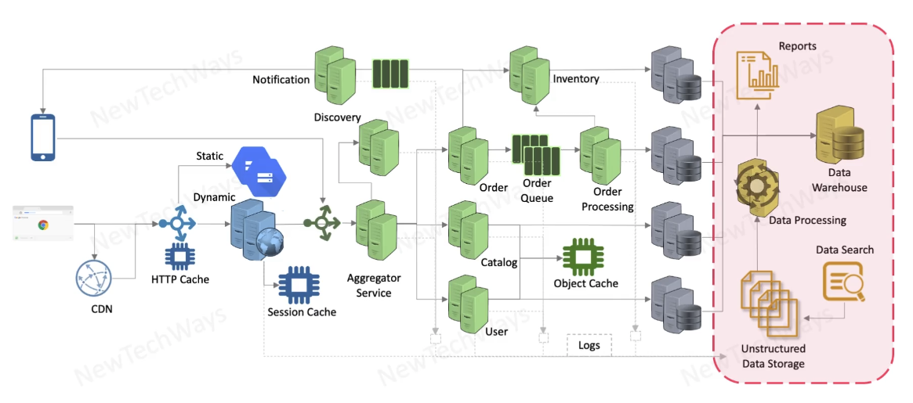

---

## Analytics solutions

Platform products for analytics

- Data Movement
  - Logstash
  - Fluentd
- Storage
  - Hadoop HDFS
    - Map-Reduce
  - Elastic Search
    - Search
- Stream Processing
  - Kafka
    - Buffer
  - Storm, Flink
    - Processing

---
  
## Logstash architecture

- Input / Output Plugins
  - Collect & Move log / stream events
- Queue
  - Reliable data movement
  - At least once delivery
  - Tracks Acks, Applies Backpressure
- Filter Plugins
  - Filter, Transform, Aggregate

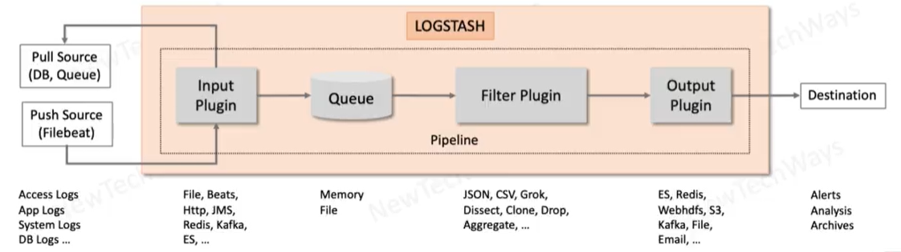

---

## Logstash data streaming architecture

- Streaming log data for Real-Time Analytics
- Horizontally Scalable & Highly Available - Any number of Logstash nodes
- Fault Tolerance - Needs reliable disk storage (RAID, Cloud persistent disks)
- Use Kafka as buffer - For heavy load that Logstash Queue cannot handle

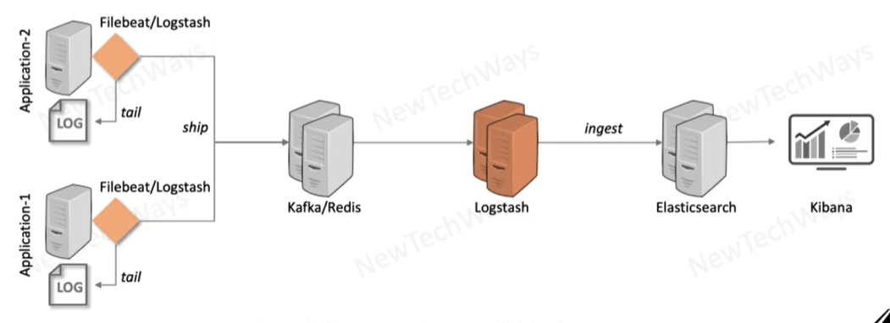

---

## Fluentd

- Older than Logstash
- Memory Footprint
  - Logstash - Heavyweight (GB)
  - Filebeat - Lightweight (MB)
  - Fluentd - Lightweight (MB)
  - Fluent Bit - Super Lightweight (KB)
- All features of Logstash
- (+) Routing
    - Tags
- (+) Docker Logging
    - Picks logs events from container console

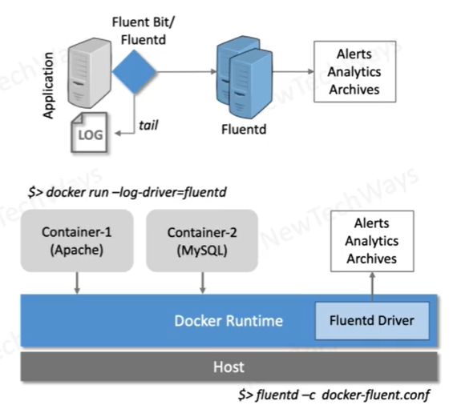

---

## Elasticsearch

Where do we store the parsed unstructured data? Elasticsearch or Hadoop 
- Hadoop is file storage for the log files
- ElasticSearch is a NoSQL Datastore
  - designed for doing full text search

**Elastic Search Features**

NoSQL Document DB that uses inverted index for full text search.

Full Text Search works by creating inverted index on each word of each row on a document.

- Full-Text Search
  - Filter, Group, Aggregate
  - Uses Inverted Index for that
- Stores JSON Documents
- Document Fetched using id
- Indexes JSON keys and values
- Structure
  - Index     ➡️ Database
  - Type      ➡️ Table
  - Document  ➡️ Row
    - JSON keys are flattened
  - Supports data types
- Users can specify mapping between terms & documents

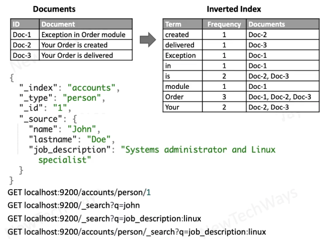

---

## Elasticsearch architecture

Even though the search request is going to one node, that node will forward the request to all the other nodes.

All these nodes in parallel and independently will execute our search.
- Distributed request
- Throughput is high
- Very low latency

Results will be returned to coordinator, which will aggregate them and will provided to the client.

- Document Oriented data-model
- Horizontally Scalable
  - Petabytes of data
  - Data is sharded with key as Document Id
  - Put / Get request goes to specific shard
  - Search queries go to all shards
- Highly Available
  -Shards are replicated
- Index structure is based on merge sort
- Index not updated with every update or insert
- Index maintained in memory
  - Occasionally flushed to disk

Updating a record, is slightly expensive. 

Adding a new record is not expensive ➡️ no update of indexes, otherwise we would have to search, disable and then add a new document.

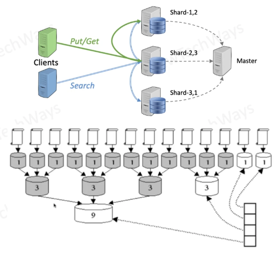

The result set should not be huge, otherwise this is not the case for elastic search (Hadoop)

---

## Hadoop HDFS

In Elastic Search we can only search small chunk of data. Result set has to be small.

We want to store the log files into Hadoop HDFS. **We can process large amount of data**.

Permanent storage of our files. can be used as a long term archive.

- Distributed File Data Storage
  - Unstructured data files
  - Petabytes of data
  - Large file size > 100MB
- Distributed files
  - Files broken into chunks
  - For parallel reads
    - Map-Reduce
- Sequential Writes - Append
  - Large blocks of data - 64MB
- Replication for reliability

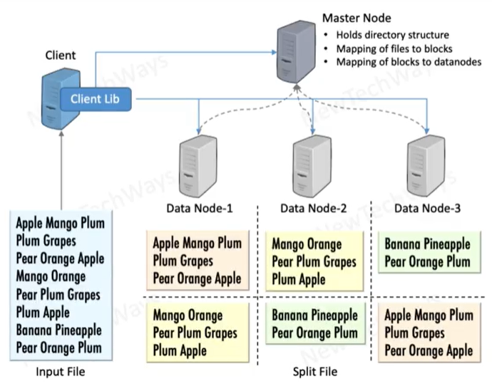

Now with can do parallel reads with map-reduce. 

---

## Map Reduce

Map reduce is a processing algorithm that runs on top of Hadoop cluster.

We want to count a certain number of exceptions we have received in our log files in the last 1 month ➡️ huge amount of data.

**Process**

- Will take all the log files and put it on Hadoop
- Hadoop will split them and put them in different nodes
  - hunderds of chunks on hundreds of nodes
- it will parse each record further and split it in smaller records
  - Map phase of Map - Reduce
  - Also parses the records by map code
  - split each line into different words - with word count
- records are broken down to key value pairs (map)
  - processing happens on the nodes the data was
- reduce phase transfers the key value pairs to some nodes
  - for reduce phase we can choose the number of machine(s) to run the reduce logic
  - configuration e.g. reduce phase in 2 nodes
  - reduce phase will have to shuffle all the keys to these two nodes
  - on which node depends by the hash of the word
  - e.g for each key will do the sum of each values (reduce logic)

**Features**

- Parallel file processing on Hadoop cluster
- Processing code executes on datanodes
- Input / Output sources
  - HDFS, HBase, Cassandra
- Map Phase
  - Filtering and transformation
- Reduce phase
  - Shuffles map output across nodes
  - Groups related information
  - Computes aggregate data

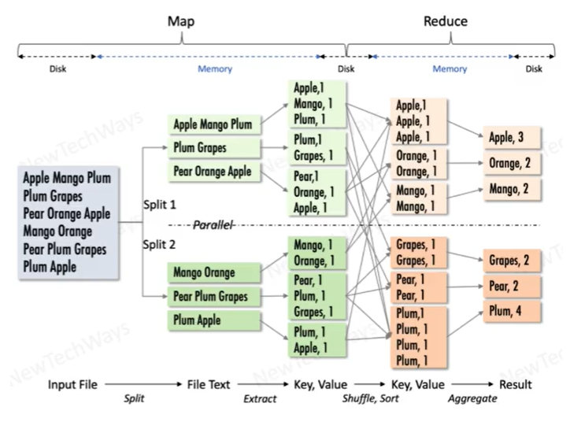

**Outcome**

Large set of files, spread over mulitple nodes, GBs of data. Map reduce has done parallel processing of each record on the same node.

Once the processing is done, the data is shuffled, grouping happens and finally the aggregation of results happen according to the reduce handler.

They key to success of Hadoop is that the map processing runs on the data nodes, no need to extract / transfer them (high cost)
- logic on each node

In map reduce we bring logic to data instead of bringing data to logic.

---

## Apache Spark

- Evolution of Map-Reduce
- In memory
  - 10x to 100x times faster
- DAG of operations
  - Multiple operations in a DAG
  - Multiple inbuilt operations
  - we can create these directed acyclic graphs of multiple operations an Spark runs them
    - avoids writing code
- Interactive
  - Interactive shell in Scala / Python / R
- In built libraries for
  - **SQL Interface, Machine Learning, Graph Processing, Streaming**
  - **Hive** run on top of Map Reduce Framework and converts SQL queries into
    - map reduce code
    - executes that on Hadoop cluster
  - **Pig**, scripting language to write the map reduce
  - can be written in **Java**
  - all provided by Spark
  - can read from **Kafka** and creates micro-batches, run map reduce and write results
    - **microbatching**, some amount of overhead

If you are considering to run any **batch processing for huge amount of data**, on Hadoop Cluster, you should choose Apache Spark and not Hadoop's native Map Reduce.

**Map Reduce Operations**
- We read once from disk by map and write on disk once by map.
- Similarly, reduce also reads once from disk and writes once on disk.
- 4 disk operations

**Spark Operations**

- Spark Reads data of HDFS but maintain the result set in memory
- The same result set will be used by reduce
- Then, it writes back on HDFS
- 2 map reduce operations instead of 4 in map reduce

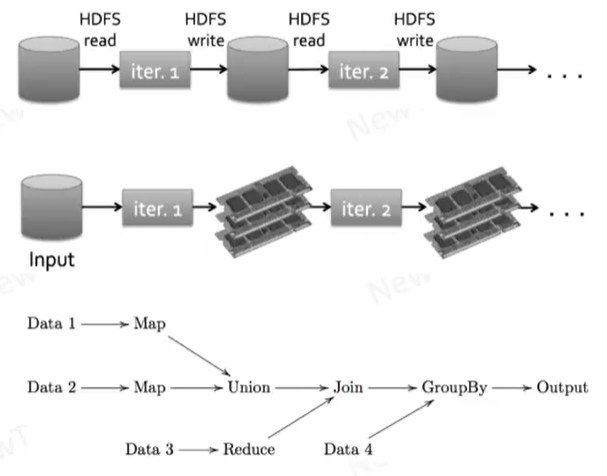

---

## Stream processing

Delivers real time analytics over any streaming data (e.g. log data)
- e.g. detect fraud
  - cannot do that with batch takes hours / days 

**Properties**

- Low latency
  - Keep data moving 
- High throughput
  - Multiple sources
- Event Issues
  - Event delay
  - Out-of-Order
  - Missing
- Fault Tolerance
  - Event Replay
- High Availability
- Processing Engine
  - Storm
  - Flink
  - Spark (Micro-Batching)
- Buffer
  - Kafka
  - On input and ouput side in case of stream processing

Stream process engine has to process the data in milliseconds, has to keep it continuously moving.

---

**Batch Workflows vs Stream Processing**

- **batch** cannot do distributed processing
  - data can be parsed, transformed, agreegated within the same node
  - continuous stream until data is stored to ES/HDFS (can take days)
  - then will analyze and produce graghs
    - ES queries can take seconds but not to be used for the last e.g. 1 second 
- **in stream** we process events on different nodes
  - and bring them to one node and aggregate them and more ops...
  - directly take that data into a stream processing engine
    - Logstash / Fluentd on one node
    - Strom / Flink / Spark for distributed systems
  - put them to Kafka because outsource may be not be able to handle data in high flow rate
    - data can go to archive
    - notification
    - real time dashboard
  - stream processing engine can directly put data into Kafka or to the final destinations

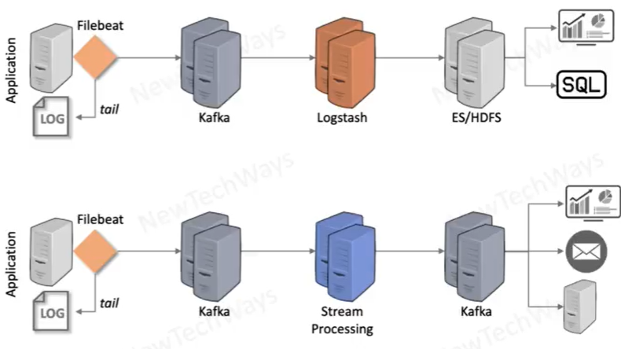

---

## Summary

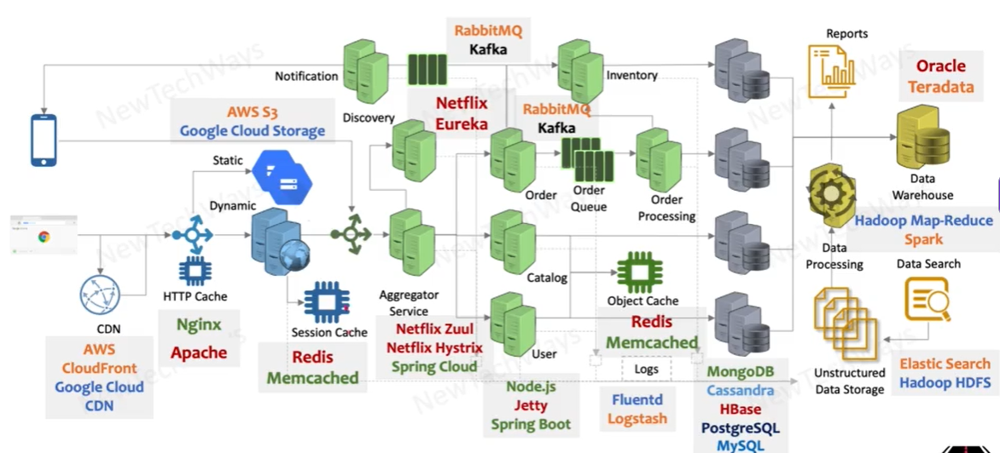

---

